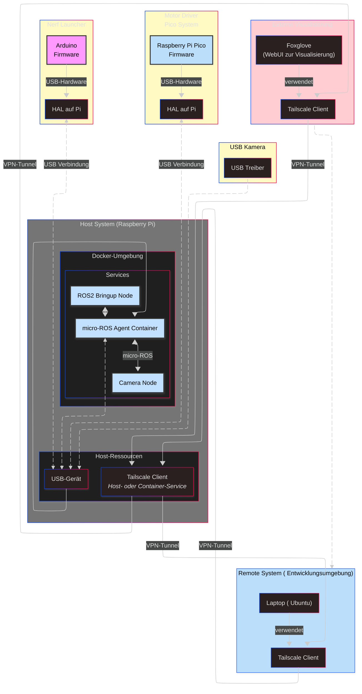

# Design-Dokument: my_steel-Roboter Docker-Deployment

## Überblick

Dieses Design-Dokument beschreibt die technische Architektur und Implementierungsstrategie für ein produktionsreifes Docker-Deployment-System des my_steel-Roboter-Systems. Die Lösung basiert auf einem Multi-Stage Docker-Build, Docker Compose-Orchestrierung und integrierter Tailscale VPN-Unterstützung für Remote-Zugriff.

## Architektur

### System-Architektur



### Container-Architektur

#### Haupt-Container (my_steel-roboter)
- **Base Image**: `ros:humble-ros-base` (ARM64)
- **Zweck**: Vollständiges ROS2-System mit allen Abhängigkeiten
- **Netzwerk**: Host-Modus für ROS2 DDS-Kommunikation
- **Volumes**: Logs, Konfiguration, Tailscale-State

#### micro-ROS Agent Container
- **Base Image**: `microros/micro-ros-agent:humble`
- **Zweck**: Bridge zwischen Raspberry Pi Pico und ROS2
- **Geräte**: USB-Zugriff auf /dev/ttyACM0
- **Abhängigkeit**: Startet vor dem Haupt-Container

## Komponenten und Interfaces

### Docker Image-Struktur

#### Multi-Stage Build-Prozess

```dockerfile
# Stage 1: Build Environment
FROM ros:humble-ros-base as builder
# - Installiert Build-Dependencies
# - Kompiliert ROS2-Workspace
# - Erstellt optimierte Binaries

# Stage 2: Runtime Environment  
FROM ros:humble-ros-base as runtime
# - Kopiert nur Runtime-Artefakte
# - Installiert Runtime-Dependencies
# - Konfiguriert Entrypoint
```

#### Image-Optimierungen
- **Multi-Stage Build**: Reduziert finale Image-Größe um ~60%
- **Layer-Caching**: Optimiert für schnelle Rebuilds
- **ARM64-spezifisch**: Native Kompilierung für Raspberry Pi 4B
- **Dependency-Cleanup**: Entfernt Build-Tools und Cache-Dateien

### Docker Compose-Konfiguration

#### Service-Definition

```yaml
# Named volumes for data persistence
volumes:
  robot_logs:
    driver: local
    driver_opts:
      type: none
      o: bind
      device: /var/log/robot
  robot_config:
    driver: local
    driver_opts:
      type: none
      o: bind
      device: /opt/robot/config
  tailscale_state:
    driver: local

# Custom networks for service isolation
networks:
  robot_network:
    driver: bridge
    ipam:
      config:
        - subnet: 172.20.0.0/16

services:
  # micro-ROS Agent Service
  microros-agent:
    image: microros/micro-ros-agent:humble
    container_name: my_steel_microros_agent
    networks:
      - robot_network
    devices:
      - "/dev/ttyACM0:/dev/ttyACM0"
    command: serial --dev /dev/ttyACM0 -v6
    restart: unless-stopped
    logging:
      driver: "json-file"
      options:
        max-size: "10m"
        max-file: "3"
    healthcheck:
      test: ["CMD", "pgrep", "-f", "micro_ros_agent"]
      interval: 10s
      timeout: 5s
      retries: 3
      start_period: 10s

  # Main Robot System Service
  robot:
    image: goldjunge491/my-steel-robot:${ROBOT_VERSION:-latest}
    container_name: my_steel_robot
    network_mode: host  # Required for ROS2 DDS multicast discovery
    depends_on:
      microros-agent:
        condition: service_healthy
    volumes:
      - robot_logs:/var/log/robot
      - robot_config:/opt/robot/config:ro
      - tailscale_state:/var/lib/tailscale
      - /dev:/dev  # Device access for hardware interfaces
    environment:
      # Robot Configuration
      - ROBOT_MODEL=${ROBOT_MODEL:-robot_xl}
      - MECANUM_DRIVE=${MECANUM_DRIVE:-true}
      - ROS_DOMAIN_ID=${ROS_DOMAIN_ID:-0}
      - RMW_IMPLEMENTATION=${RMW_IMPLEMENTATION:-rmw_fastrtps_cpp}
      
      # Tailscale Configuration
      - TAILSCALE_AUTHKEY=${TAILSCALE_AUTHKEY:-}
      - TAILSCALE_HOSTNAME=${TAILSCALE_HOSTNAME:-my-steel-robot}
      - TAILSCALE_SUBNET_ROUTES=${TAILSCALE_SUBNET_ROUTES:-}
      
      # Logging Configuration
      - LOG_LEVEL=${LOG_LEVEL:-INFO}
      - LOG_RETENTION_DAYS=${LOG_RETENTION_DAYS:-7}
    privileged: true  # Required for hardware access and Tailscale
    restart: unless-stopped
    logging:
      driver: "json-file"
      options:
        max-size: "50m"
        max-file: "5"
    healthcheck:
      test: |
        ros2 node list > /dev/null 2>&1 && \
        ros2 topic list | grep -q "/joint_states"
      interval: 30s
      timeout: 10s
      retries: 3
      start_period: 60s

  # Optional: Monitoring Service
  watchtower:
    image: containrrr/watchtower:latest
    container_name: my_steel_watchtower
    volumes:
      - /var/run/docker.sock:/var/run/docker.sock
    environment:
      - WATCHTOWER_CLEANUP=true
      - WATCHTOWER_POLL_INTERVAL=3600  # Check for updates every hour
      - WATCHTOWER_INCLUDE_STOPPED=true
    restart: unless-stopped
    profiles:
      - monitoring  # Only start with --profile monitoring
```

### Startup-Sequenz

#### Container-Initialisierung

1. **Pre-Start Checks**
   - USB-Gerät-Verfügbarkeit prüfen
   - Netzwerk-Konnektivität testen
   - Volume-Mounts validieren

2. **micro-ROS Agent Start**
   - Verbindung zu Raspberry Pi Pico etablieren
   - Health-Check bestätigt Bereitschaft
   - Signal an abhängige Services

3. **Haupt-Container Start**
   - ROS2-Umgebung initialisieren
   - Workspace sourcen
   - Tailscale-Client starten (optional)
   - Bringup-System mit 30s Timeout starten

#### Startup-Script (entrypoint.sh)

```bash
#!/bin/bash
set -e

# ROS2 Environment Setup
source /opt/ros/humble/setup.bash
source /opt/robot/install/setup.bash

# Tailscale Setup (if configured)
if [[ -n "${TAILSCALE_AUTHKEY}" ]]; then
    echo "Initializing Tailscale..."
    tailscaled --state=/var/lib/tailscale/tailscaled.state &
    sleep 2
    tailscale up --authkey="${TAILSCALE_AUTHKEY}" --hostname="${TAILSCALE_HOSTNAME}"
fi

# Wait for micro-ROS Agent
echo "Waiting for micro-ROS Agent connection..."
timeout 30 bash -c 'until ros2 topic list | grep -q "/rt/"; do sleep 1; done' || {
    echo "Warning: micro-ROS Agent not detected within 30 seconds"
}

# Start Robot Bringup
echo "Starting my_steel robot system..."
exec ros2 launch robot_bringup bringup.launch.py \
    robot_model:=robot_xl \
    mecanum:=true \
    use_sim:=false
```

## Datenmodelle

### Konfigurationsstruktur

#### Environment Variables
```bash
# Robot Configuration
ROBOT_MODEL=robot_xl
MECANUM_DRIVE=true
ROS_DOMAIN_ID=0  # Standard-Domain für normale ROS2-Kommunikation
RMW_IMPLEMENTATION=rmw_fastrtps_cpp

# Tailscale Configuration
TAILSCALE_AUTHKEY=tskey-auth-xxxxx
TAILSCALE_HOSTNAME=my-steel-robot-01
TAILSCALE_SUBNET_ROUTES=192.168.1.0/24

# Logging Configuration
LOG_LEVEL=INFO
LOG_RETENTION_DAYS=7
```

#### Volume-Struktur
```
/var/log/robot/                    # Log-Persistenz
├── 17_10_25_14:30/               # Zeitstempel-Ordner
│   ├── ros2_bringup.log          # ROS2 System-Logs
│   ├── controller_manager.log    # Controller-spezifische Logs
│   └── microros_agent.log        # micro-ROS Bridge-Logs
└── current -> 17_10_25_14:30/    # Symlink auf aktuelle Session

/opt/robot/config/                 # Konfiguration
├── robot_xl/                     # Roboter-spezifische Configs
│   ├── mecanum_controller.yaml   # Controller-Parameter
│   └── hardware_interface.yaml  # Hardware-Konfiguration
└── tailscale/                    # VPN-Konfiguration
    └── tailscaled.conf           # Tailscale-Einstellungen

/var/lib/tailscale/               # Tailscale-State
└── tailscaled.state             # Persistenter VPN-Zustand
```

### Log-Management

#### Strukturierte Logs
- **Zeitstempel-Format**: `dd_mm_yy_hh:mm` für eindeutige Identifikation
- **Service-Trennung**: Separate Log-Dateien pro Service
- **Rotation**: Automatische Bereinigung nach 7 Tagen
- **Symlink**: `current` zeigt auf aktuelle Log-Session

#### Log-Aggregation
```bash
# Log-Rotation Script (cron-job)
#!/bin/bash
LOG_DIR="/var/log/robot"
RETENTION_DAYS=7

# Create new timestamped directory
TIMESTAMP=$(date +"%d_%m_%y_%H:%M")
mkdir -p "${LOG_DIR}/${TIMESTAMP}"

# Update current symlink
ln -sfn "${TIMESTAMP}" "${LOG_DIR}/current"

# Cleanup old logs
find "${LOG_DIR}" -maxdepth 1 -type d -name "*_*_*_*" -mtime +${RETENTION_DAYS} -exec rm -rf {} \;
```

## Fehlerbehandlung

### Health-Check-System

#### Container-Health-Checks
```yaml
# Robot Container Health-Check
healthcheck:
  test: |
    ros2 node list > /dev/null 2>&1 && \
    ros2 topic list | grep -q "/joint_states" && \
    ros2 service list | grep -q "/controller_manager"
  interval: 30s
  timeout: 10s
  retries: 3
  start_period: 60s

# micro-ROS Agent Health-Check  
healthcheck:
  test: |
    pgrep -f "micro_ros_agent" > /dev/null && \
    netstat -ln | grep -q ":8888"
  interval: 10s
  timeout: 5s
  retries: 3
```

#### Restart-Strategien
- **unless-stopped**: Container startet automatisch nach Host-Reboot
- **Health-Check Failures**: Automatischer Neustart nach 3 aufeinanderfolgenden Fehlern
- **Dependency-Management**: Abhängige Services warten auf Health-Check-Bestätigung

### Graceful Shutdown

#### SIGTERM-Handling
```bash
# Signal Handler in entrypoint.sh
cleanup() {
    echo "Received SIGTERM, shutting down gracefully..."
    
    # Stop ROS2 nodes
    if [[ -n "${ROS2_PID}" ]]; then
        kill -TERM "${ROS2_PID}"
        wait "${ROS2_PID}" 2>/dev/null || true
    fi
    
    # Disconnect Tailscale
    if [[ -n "${TAILSCALE_AUTHKEY}" ]]; then
        tailscale down || true
        pkill tailscaled || true
    fi
    
    echo "Shutdown complete"
    exit 0
}

trap cleanup SIGTERM SIGINT
```

#### Timeout-Management
- **Graceful Shutdown**: 30 Sekunden für sauberes Herunterfahren
- **Force Kill**: SIGKILL nach Timeout
- **State Persistence**: Tailscale-Zustand wird vor Shutdown gespeichert

## Testing-Strategie

### Kontinuierliche Validierung
**WICHTIG**: Nach jeder Implementierungsänderung MUSS das gesamte System getestet und validiert werden, um sicherzustellen, dass alle Komponenten korrekt funktionieren.

#### Automatisierte Test-Pipeline
```bash
#!/bin/bash
# test-deployment.sh - Vollständige System-Validierung

set -e

echo "=== Docker Deployment Test Suite ==="

# 1. Build-Tests
echo "1. Testing Docker Build..."
docker build -t my-steel-robot:test .
docker images | grep my-steel-robot:test

# 2. Compose-Validierung
echo "2. Validating Docker Compose..."
docker compose config --quiet
docker compose ps

# 3. Service-Health-Tests
echo "3. Testing Service Health..."
docker compose up -d
sleep 30

# Warten auf Health-Checks
for service in microros-agent robot; do
    echo "Checking health of $service..."
    timeout 60 bash -c "until docker compose ps $service | grep -q 'healthy'; do sleep 5; done"
done

# 4. Funktionalitäts-Tests
echo "4. Testing Robot Functionality..."
docker compose exec robot ros2 node list
docker compose exec robot ros2 topic list | grep -q "/joint_states"
docker compose exec robot ros2 service list | grep -q "/controller_manager"

# 5. Hardware-Integration-Tests
echo "5. Testing Hardware Integration..."
docker compose exec robot ls -la /dev/ttyACM0
docker compose exec microros-agent pgrep -f micro_ros_agent

# 6. Netzwerk-Tests
echo "6. Testing Network Connectivity..."
docker compose exec robot ping -c 3 8.8.8.8
if [[ -n "${TAILSCALE_AUTHKEY}" ]]; then
    docker compose exec robot tailscale status
fi

# 7. Log-Validierung
echo "7. Validating Log Structure..."
ls -la /var/log/robot/
test -L /var/log/robot/current

# 8. Performance-Tests
echo "8. Testing Performance..."
IMAGE_SIZE=$(docker images my-steel-robot:test --format "table {{.Size}}" | tail -n 1)
echo "Image size: $IMAGE_SIZE"

# 9. Cleanup
echo "9. Cleanup..."
docker compose down
docker rmi my-steel-robot:test

echo "=== All Tests Passed! ==="
```

### Mandatory Test-Checkliste

#### Nach jeder Code-Änderung:
- [ ] **Docker Build**: Image baut erfolgreich ohne Fehler
- [ ] **Compose Validation**: `docker compose config` läuft fehlerfrei
- [ ] **Service Startup**: Alle Services starten und werden healthy
- [ ] **ROS2 Functionality**: Nodes, Topics und Services sind verfügbar
- [ ] **Hardware Access**: USB-Geräte sind zugänglich
- [ ] **Network Connectivity**: Host-Netzwerk und externe Verbindungen funktionieren
- [ ] **Log Generation**: Logs werden korrekt strukturiert geschrieben
- [ ] **Health Checks**: Alle Health-Check-Endpunkte antworten korrekt

#### Erweiterte Validierung:
- [ ] **Tailscale Integration**: VPN-Verbindung funktioniert (falls konfiguriert)
- [ ] **Graceful Shutdown**: Container fahren sauber herunter
- [ ] **Restart Resilience**: Services starten nach Neustart korrekt
- [ ] **Resource Limits**: CPU/Memory-Verbrauch im akzeptablen Bereich
- [ ] **Image Size**: Finale Image-Größe < 2GB

### Unit-Tests

#### Docker Build-Validierung
```bash
# Dockerfile-Syntax-Test
docker build --dry-run -t test .

# Multi-Stage Build-Test
docker build --target builder -t test-builder .
docker build --target runtime -t test-runtime .

# ARM64-Kompatibilität
docker buildx build --platform linux/arm64 -t test-arm64 .
```

#### Entrypoint-Script-Tests
```bash
# Syntax-Validierung
bash -n entrypoint.sh

# Funktions-Tests
docker run --rm -it my-steel-robot:test bash -c "
    source /entrypoint.sh
    test_ros_environment
    test_tailscale_setup
    test_hardware_detection
"
```

### Integration-Tests

#### Container-Orchestrierung
```bash
# Service-Dependencies
docker compose up microros-agent
docker compose ps microros-agent | grep -q "healthy"
docker compose up robot
docker compose ps robot | grep -q "healthy"

# Volume-Mounts
docker compose exec robot ls -la /var/log/robot
docker compose exec robot ls -la /opt/robot/config
docker compose exec robot ls -la /var/lib/tailscale
```

#### Hardware-Integration
```bash
# USB-Device-Access
docker compose exec robot ls -la /dev/ttyACM0
docker compose exec microros-agent lsusb | grep -i pico

# ROS2-micro-ROS Communication
docker compose exec robot ros2 topic list | grep "/rt/"
docker compose exec robot ros2 topic echo /rt/joint_states --max-count 1
```

### Performance-Tests

#### System-Performance
```bash
# Container-Resource-Usage
docker stats --no-stream my_steel_robot my_steel_microros_agent

# Startup-Zeit-Messung
time docker compose up -d
timeout 60 bash -c 'until docker compose ps robot | grep -q "healthy"; do sleep 1; done'

# Image-Größe-Validierung
docker images goldjunge491/my-steel-robot:latest --format "table {{.Size}}"
```

#### Network-Performance
```bash
# ROS2 DDS-Latenz
docker compose exec robot ros2 topic hz /joint_states
docker compose exec robot ros2 topic bw /joint_states

# Tailscale-Performance (falls aktiviert)
docker compose exec robot tailscale ping remote-pc
```

### End-to-End-Tests

#### Vollständiger Deployment-Zyklus
```bash
#!/bin/bash
# e2e-test.sh - End-to-End Deployment Test

# 1. Clean Environment
docker compose down -v
docker system prune -f

# 2. Fresh Deployment
git pull origin main
docker compose pull
docker compose up -d

# 3. System Readiness
sleep 60
docker compose ps | grep -q "healthy.*healthy"

# 4. Robot Functionality
docker compose exec robot ros2 launch robot_bringup bringup.launch.py &
sleep 30
docker compose exec robot ros2 topic pub /cmd_vel geometry_msgs/msg/Twist "{linear: {x: 0.1}}" --once

# 5. Remote Access (falls Tailscale aktiv)
if [[ -n "${TAILSCALE_AUTHKEY}" ]]; then
    docker compose exec robot tailscale status | grep -q "online"
fi

# 6. Log Verification
test -f /var/log/robot/current/ros2_bringup.log
test -f /var/log/robot/current/microros_agent.log

echo "E2E Test completed successfully!"
```

### Continuous Integration

#### GitHub Actions Test-Workflow
```yaml
name: Test Docker Deployment

on: [push, pull_request]

jobs:
  test:
    runs-on: ubuntu-latest
    steps:
      - uses: actions/checkout@v3
      
      - name: Set up Docker Buildx
        uses: docker/setup-buildx-action@v2
        
      - name: Build Test Image
        run: docker build -t my-steel-robot:test .
        
      - name: Validate Compose
        run: docker compose config --quiet
        
      - name: Run Test Suite
        run: ./scripts/test-deployment.sh
        
      - name: Upload Test Results
        uses: actions/upload-artifact@v3
        if: always()
        with:
          name: test-results
          path: test-results/
```

### Fehler-Debugging

#### Häufige Test-Failures
```bash
# Service startet nicht
docker compose logs microros-agent
docker compose logs robot

# Health-Check schlägt fehl
docker compose exec robot ros2 doctor
docker compose exec robot systemctl status

# Hardware nicht verfügbar
ls -la /dev/ttyACM*
dmesg | grep -i usb

# Netzwerk-Probleme
docker compose exec robot ip addr show
docker compose exec robot netstat -tuln
```

**KRITISCHE REGELN**: 
1. Jede Implementierungsaufgabe MUSS mit der vollständigen Test-Suite validiert werden, bevor sie als abgeschlossen betrachtet wird
2. Keine Änderung darf ohne erfolgreiche Tests committed werden
3. **KEINE NEUEN DATEIEN** dürfen ohne explizite Genehmigung erstellt werden - nur vorhandene Dateien bearbeiten
4. Alle Änderungen müssen auf bestehende Dateien und Strukturen aufbauen

## Referenz-Implementierungen

### Bewährte Praktiken aus der Community

#### INTAS ROS2 Humble Docker Environment
- **Quelle**: https://gitlab.uni-koblenz.de/intas/ros2-humble-macos-docker-env
- **Relevanz**: Bewährte ROS2 Humble Docker-Konfiguration für Cross-Platform-Entwicklung
- **Anwendung**: Multi-Stage Build-Patterns und ARM64-Optimierungen

#### Husarion ROSbot XL Autonomy (Foxglove Branch)
- **Quelle**: https://github.com/husarion/robot-xl-autonomy/tree/foxglove
- **Relevanz**: Produktionsreife Docker-Orchestrierung für robot_xl mit Foxglove-Integration
- **Anwendung**: Container-Architektur, Launch-Konfigurationen und Hardware-Interfaces

#### Dan Aukes ROS2 Networking Guides
- **Quelle**: https://www.danaukes.com/notebook/ros2/
- **Relevanz**: ROS2 Docker + Tailscale VPN Integration, Raspberry Pi Deployment
- **Anwendung**: Netzwerk-Konfiguration, DDS-Settings und VPN-Integration

#### ROS Dabbler Networking Adventures
- **Quelle**: https://rosdabbler.github.io/adventures-in-ros2-networking-2
- **Relevanz**: Erweiterte ROS2-Netzwerk-Konfigurationen mit Docker
- **Anwendung**: Bridge-Netzwerke, Macvlan-Konfigurationen und Multi-Host-Setups

### Implementierungs-Patterns aus Referenzen

#### Dockerfile-Optimierungen (INTAS-Pattern)
```dockerfile
# Basierend auf INTAS ros2-humble.dockerfile
FROM ros:humble-ros-base as builder

# Build-Dependencies (nur in Builder-Stage)
RUN apt-get update && apt-get install -y \
    build-essential \
    cmake \
    git \
    python3-colcon-common-extensions \
    python3-rosdep \
    && rm -rf /var/lib/apt/lists/*

# Workspace Build
WORKDIR /opt/robot
COPY src/ src/
RUN rosdep install --from-paths src --ignore-src -r -y
RUN colcon build --cmake-args -DCMAKE_BUILD_TYPE=Release

# Runtime Stage (INTAS-optimiert)
FROM ros:humble-ros-base as runtime
RUN apt-get update && apt-get install -y \
    ros-humble-micro-ros-agent \
    ros-humble-foxglove-bridge \
    tailscale \
    && rm -rf /var/lib/apt/lists/*

COPY --from=builder /opt/robot/install /opt/robot/install
```

#### Husarion-Pattern für robot_xl Integration
```yaml
# Basierend auf husarion/robot-xl-autonomy
services:
  robot:
    image: goldjunge491/my-steel-robot:${ROBOT_VERSION:-latest}
    environment:
      # Husarion-kompatible Parameter
      - ROBOT_MODEL=robot_xl
      - MECANUM_DRIVE=true
      - USE_GPU=false
      - FASTRTPS_DEFAULT_PROFILES_FILE=/opt/robot/config/fastrtps.xml
    volumes:
      - /dev:/dev
      - robot_config:/opt/robot/config:ro
    privileged: true
    network_mode: host
```

#### Dan Aukes Tailscale-Integration
```bash
# Basierend auf danaukes.com Tailscale-Guide
setup_tailscale() {
    if [[ -n "${TAILSCALE_AUTHKEY}" ]]; then
        echo "Setting up Tailscale VPN..."
        
        # Start Tailscale daemon
        tailscaled --state=/var/lib/tailscale/tailscaled.state --socket=/var/run/tailscale/tailscaled.sock &
        sleep 2
        
        # Connect to network
        tailscale up \
            --authkey="${TAILSCALE_AUTHKEY}" \
            --hostname="${TAILSCALE_HOSTNAME}" \
            --accept-routes \
            --advertise-routes="${TAILSCALE_SUBNET_ROUTES:-}"
        
        # Configure ROS2 for VPN
        export ROS_LOCALHOST_ONLY=0
        export FASTRTPS_DEFAULT_PROFILES_FILE=/opt/robot/config/fastrtps_tailscale.xml
    fi
}
```

#### ROS Dabbler Netzwerk-Optimierungen
```xml
<!-- FastRTPS-Profil für Docker-Netzwerke -->
<?xml version="1.0" encoding="UTF-8" ?>
<profiles xmlns="http://www.eprosima.com/XMLSchemas/fastRTPS_Profiles">
    <participant profile_name="docker_participant">
        <rtps>
            <builtin>
                <discovery_config>
                    <discoveryProtocol>SIMPLE</discoveryProtocol>
                    <use_SIMPLE_EndpointDiscoveryProtocol>true</use_SIMPLE_EndpointDiscoveryProtocol>
                    <use_SIMPLE_ParticipantDiscoveryProtocol>true</use_SIMPLE_ParticipantDiscoveryProtocol>
                    <simpleEDP>
                        <PUBWRITER_SUBREADER>true</PUBWRITER_SUBREADER>
                        <PUBREADER_SUBWRITER>true</PUBREADER_SUBWRITER>
                    </simpleEDP>
                </discovery_config>
            </builtin>
        </rtps>
    </participant>
</profiles>
```

## Implementierungs-Richtlinien

### Datei-Management-Regeln
**WICHTIG**: Bei der Implementierung dürfen NUR vorhandene Dateien bearbeitet werden:

#### Erlaubte Aktionen:
✅ **Bearbeitung vorhandener Dateien**: Dockerfile, docker-compose.yml, Scripts, etc.
✅ **Modifikation bestehender Konfigurationen**: Anpassung von YAML, ENV-Dateien
✅ **Erweiterung vorhandener Scripts**: Hinzufügen von Funktionen zu bestehenden Dateien
✅ **Update bestehender Dokumentation**: README, Kommentare in Code

#### VERBOTENE Aktionen:
❌ **Neue Dateien erstellen**: Ohne explizite Genehmigung
❌ **Neue Verzeichnisse anlegen**: Ohne Absprache
❌ **Zusätzliche Scripts**: Ohne Autorisierung
❌ **Neue Konfigurationsdateien**: Ohne Erlaubnis

#### Workflow für Datei-Änderungen:
1. **Identifiziere vorhandene Dateien** im Repository
2. **Analysiere bestehende Struktur** und Inhalte
3. **Modifiziere nur vorhandene Dateien** entsprechend den Anforderungen
4. **Teste alle Änderungen** mit der bestehenden Struktur
5. **Validiere Kompatibilität** mit vorhandenen Systemen

## Deployment-Strategie

### Build-Pipeline

#### CI/CD-Workflow
```yaml
# GitHub Actions Workflow
name: Build and Deploy Robot Image

on:
  push:
    tags: ['v*']
  pull_request:
    branches: [main]

jobs:
  build:
    runs-on: ubuntu-latest
    steps:
      - uses: actions/checkout@v3
      
      - name: Set up Docker Buildx
        uses: docker/setup-buildx-action@v2
        with:
          platforms: linux/arm64
          
      - name: Build and push
        uses: docker/build-push-action@v4
        with:
          context: .
          platforms: linux/arm64
          push: ${{ github.event_name != 'pull_request' }}
          tags: |
            goldjunge491/my-steel-robot:latest
            goldjunge491/my-steel-robot:${{ github.ref_name }}
```

#### Versionierung
- **Semantic Versioning**: MAJOR.MINOR.PATCH
- **Git Tags**: Automatische Image-Tags basierend auf Git-Tags
- **Latest Tag**: Zeigt auf neueste stabile Version
- **Development Tags**: Separate Tags für Entwicklungsversionen

### Raspberry Pi Deployment

#### Erstinstallation
```bash
# 1. Docker Installation
curl -fsSL https://get.docker.com -o get-docker.sh
sudo sh get-docker.sh
sudo usermod -aG docker $USER

# 2. Docker Compose Installation
sudo apt-get update
sudo apt-get install docker-compose-plugin

# 3. System Directories Setup
sudo mkdir -p /var/log/robot /opt/robot/config
sudo chown -R $USER:$USER /var/log/robot /opt/robot

# 4. Repository Clone
git clone https://github.com/user/my-steel-robot-deployment.git
cd my-steel-robot-deployment

# 5. Environment Setup
cp .env.example .env
# Edit .env with specific configuration:
# ROBOT_VERSION=1.0.0
# TAILSCALE_AUTHKEY=tskey-auth-xxxxx
# TAILSCALE_HOSTNAME=my-steel-robot-01

# 6. Initial Deployment
docker compose up -d

# 7. Optional: Start with monitoring
docker compose --profile monitoring up -d
```

#### Update-Prozess
```bash
# 1. Pull latest configuration
git pull origin main

# 2. Pull new images
docker compose pull

# 3. Graceful restart
docker compose down
docker compose up -d

# 4. Verify deployment
docker compose ps
docker compose logs -f robot
```

### Monitoring und Wartung

#### System-Monitoring
- **Container-Status**: `docker compose ps` für Service-Übersicht
- **Log-Monitoring**: Strukturierte Logs in `/var/log/robot/`
- **Health-Checks**: Automatische Überwachung der Container-Gesundheit
- **Resource-Usage**: Docker Stats für Performance-Monitoring

#### Wartungsaufgaben
- **Log-Rotation**: Automatische Bereinigung alter Logs
- **Image-Updates**: Regelmäßige Updates der Base-Images
- **Security-Patches**: Zeitnahe Anwendung von Sicherheitsupdates
- **Backup**: Konfiguration und Tailscale-State sichern

Diese Design-Architektur gewährleistet eine robuste, skalierbare und wartbare Docker-Deployment-Lösung für das my_steel-Roboter-System mit integrierter VPN-Unterstützung und umfassendem Monitoring.