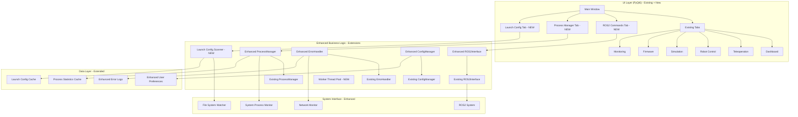

# Design Document

## Overview

The Robot Control GUI Enhancements extend the existing PyQt6-based robot control application by building upon the current six-tab architecture (Dashboard, Teleoperation, Robot Control, Simulation, Firmware, Monitoring) and core modules (ConfigManager, ProcessManager, ErrorHandler, ROS2Interface). The design adds three new tabs with advanced capabilities while preserving all existing functionality and user workflows.

The enhancement strategy follows an extension-based architecture where new features integrate with existing modules through well-defined interfaces. This approach ensures complete backward compatibility, maintains the current user experience, and provides a foundation for future enhancements. All new components leverage the existing PyQt6 styling system, error handling patterns, and configuration management.

## Architecture

### Enhanced System Architecture



### Component Integration Strategy

The enhancements integrate with the existing system through:

1. **Tab Extension**: Three new tabs (ROS2 Commands, Process Manager, Launch Configs) added to the existing QTabWidget in MainWindow
2. **Module Enhancement**: Extend existing core modules (ROS2Interface, ProcessManager, ErrorHandler, ConfigManager) with new capabilities while preserving current functionality
3. **Signal/Slot Integration**: Leverage existing PyQt signal/slot patterns for inter-component communication and status updates
4. **Shared Resources**: Reuse existing styling (StyleManager), error handling patterns, and configuration structures
5. **Backward Compatibility**: All existing functionality remains unchanged, ensuring current workflows continue to work
6. **Progressive Enhancement**: New features can be enabled/disabled through configuration without affecting core operations

## Components and Interfaces

### 1. Enhanced ROS2 Interface

**Purpose**: Extends the existing ROS2Interface class with advanced command capabilities while maintaining all current functionality.

**Integration Approach**: 
- Inherit from existing ROS2Interface class
- Add new methods without modifying existing ones
- Leverage existing error handling and subprocess management
- Maintain compatibility with current monitoring widgets

**Key Classes**:
```python
class EnhancedROS2Interface(ROS2Interface):
    def __init__(self, error_handler: ErrorHandler):
        super().__init__(error_handler)
        self.command_cache = {}
        self.service_schemas = {}
    
    # Enhanced node operations (extends existing get_node_info)
    def get_node_info_detailed(self, node_name: str) -> NodeInfoDetailed
    def get_all_nodes_with_info(self) -> Dict[str, NodeInfoDetailed]
    def get_node_resource_usage(self, node_name: str) -> NodeResourceInfo
    
    # Service operations (new functionality)
    def get_service_list_with_types(self) -> List[ServiceInfo]
    def call_service(self, service_name: str, request_data: Dict) -> ServiceResponse
    def get_service_type_definition(self, service_type: str) -> ServiceTypeDefinition
    
    # Parameter operations (new functionality)
    def get_all_parameters(self) -> Dict[str, Dict[str, ParameterInfo]]
    def set_parameter(self, node_name: str, param_name: str, value: Any) -> bool
    def get_parameter_descriptions(self, node_name: str) -> Dict[str, str]
    
    # Bag operations (new functionality)
    def record_bag(self, topics: List[str], output_path: str, 
                   callback: Callable[[BagRecordStatus], None]) -> BagRecorder
    def play_bag(self, bag_path: str, options: BagPlayOptions,
                 callback: Callable[[BagPlayStatus], None]) -> BagPlayer
    def get_bag_info(self, bag_path: str) -> BagInfo

class NodeInfoDetailed:
    name: str
    namespace: str
    publishers: List[TopicInfo]
    subscribers: List[TopicInfo]
    services: List[ServiceInfo]
    parameters: Dict[str, ParameterInfo]
    cpu_usage: float
    memory_usage: int
    uptime: float

class ServiceInfo:
    name: str
    service_type: str
    request_schema: Dict
    response_schema: Dict
    
class ParameterInfo:
    name: str
    type: str
    value: Any
    description: str
    constraints: Optional[Dict]
    
class BagRecorder:
    def start(self) -> bool
    def stop(self) -> bool
    def get_status(self) -> BagRecordStatus
    def get_statistics(self) -> BagRecordStats
```

**Integration**: Seamlessly extends existing ROS2Interface functionality used by current Monitoring widget and other components.

### 2. Enhanced Error Handling System

**Purpose**: Extends the existing ErrorHandler class with intelligent recovery mechanisms and proactive monitoring.

**Integration Approach**:
- Enhance existing ErrorHandler without breaking current error handling
- Add new error classification and recovery strategies
- Integrate with existing log management system
- Maintain compatibility with current error dialogs

**Key Classes**:
```python
class EnhancedErrorHandler(ErrorHandler):
    def __init__(self, log_dir: str):
        super().__init__(log_dir)
        self.recovery_strategies = {}
        self.error_queue = []
        self.network_monitor = NetworkMonitor()
    
    def register_recovery_strategy(self, error_type: str, strategy: RecoveryStrategy)
    def handle_error_with_recovery(self, error: Exception, context: ErrorContext) -> ErrorResponse
    def attempt_automatic_recovery(self, error: Exception) -> bool
    def enter_safe_mode(self, reason: str)
    def exit_safe_mode(self) -> bool
    def get_error_statistics(self) -> ErrorStatistics

class ErrorContext:
    component: str
    operation: str
    timestamp: datetime
    system_state: Dict[str, Any]
    user_action: Optional[str]
    
class RecoveryAction:
    action_type: str  # "retry", "reconnect", "restart", "reset"
    parameters: Dict[str, Any]
    max_attempts: int
    backoff_strategy: str  # "linear", "exponential", "fixed"
    
class NetworkMonitor:
    def __init__(self, callback: Callable[[NetworkStatus], None])
    def start_monitoring(self)
    def stop_monitoring(self)
    def test_connection(self, host: str, port: int) -> bool
    
class AutoRecoveryManager:
    def __init__(self, error_system: ErrorRecoverySystem)
    def enable_auto_recovery(self, error_types: List[str])
    def disable_auto_recovery(self, error_types: List[str])
    def set_recovery_policy(self, error_type: str, policy: RecoveryPolicy)
```

**Error Classification**:
- **Critical**: System instability, data corruption
- **Warning**: Feature unavailable, performance degraded  
- **Info**: Status changes, operation completion
- **Recoverable**: Network issues, process crashes
- **User**: Invalid input, configuration errors

### 3. Enhanced Process Management System

**Purpose**: Extends the existing ProcessManager with comprehensive system monitoring and advanced process control capabilities.

**Integration Approach**:
- Enhance existing ProcessManager class with system-wide monitoring
- Add resource tracking without affecting current process management
- Integrate with existing process lifecycle management
- Maintain compatibility with current process status reporting

**Key Classes**:
```python
class EnhancedProcessManager(ProcessManager):
    def __init__(self, error_handler: ErrorHandler):
        super().__init__(error_handler)
        self.system_monitor = SystemMonitor()
        self.resource_tracker = ResourceTracker()
        self.process_tree_builder = ProcessTreeBuilder()
    
    def start_system_monitoring(self)
    def stop_system_monitoring(self)
    def get_process_statistics(self, process_name: str) -> ProcessStatistics
    def get_system_overview(self) -> SystemOverview
    def detect_zombie_processes(self) -> List[ProcessInfo]
    def generate_diagnostics_report(self) -> DiagnosticsReport
    def get_process_tree(self) -> ProcessTree

class ProcessStatistics:
    pid: int
    name: str
    cpu_percent: float
    memory_mb: int
    io_read_bytes: int
    io_write_bytes: int
    open_files: List[str]
    threads: int
    status: str
    history: List[ProcessSnapshot]  # Last 60 data points
    
class SystemOverview:
    total_processes: int
    cpu_usage_percent: float
    memory_usage_percent: float
    disk_usage_percent: float
    network_io: NetworkIOStats
    uptime: float
    
class ProcessTreeBuilder:
    def build_tree(self, processes: List[ProcessInfo]) -> ProcessTree
    def find_children(self, parent_pid: int) -> List[ProcessInfo]
    def find_root_processes(self) -> List[ProcessInfo]
    
class ResourceTracker:
    def __init__(self, update_interval: float = 2.0)
    def track_process(self, pid: int)
    def untrack_process(self, pid: int)
    def get_historical_data(self, pid: int, duration: int) -> List[ProcessSnapshot]
```

**Performance Monitoring**:
- CPU usage per process and system-wide
- Memory consumption with leak detection
- I/O statistics (read/write bytes, file handles)
- Network activity per process
- Thread count and status

### 4. Launch Configuration Management System

**Purpose**: Provides intelligent discovery, parsing, and management of ROS2 launch configurations with workspace integration.

**Integration Approach**:
- New standalone system that integrates with existing workspace structure
- Leverages existing ConfigManager for persistence
- Uses existing ProcessManager for launch execution
- Integrates with current error handling patterns

**Key Classes**:
```python
class LaunchConfigScanner:
    def __init__(self, workspace_path: str, config_manager: ConfigManager):
        self.workspace_path = workspace_path
        self.config_manager = config_manager
        self.file_watcher = FileSystemWatcher()
        self.parsers = {
            '.py': PythonLaunchParser(),
            '.xml': XMLLaunchParser(),
            '.launch': XMLLaunchParser()
        }
    
    def scan_workspace(self) -> List[LaunchConfig]
    def parse_launch_file(self, file_path: str) -> LaunchConfig
    def extract_parameters(self, launch_config: LaunchConfig) -> List[LaunchParameter]
    def validate_dependencies(self, launch_config: LaunchConfig) -> DependencyGraph
    def watch_for_changes(self, callback: Callable[[List[LaunchConfig]], None])
    def get_cached_configs(self) -> List[LaunchConfig]

class LaunchConfig:
    name: str
    package: str
    file_path: str
    file_type: str  # "python", "xml", "yaml"
    description: str
    parameters: List[LaunchParameter]
    dependencies: List[str]
    tags: List[str]
    last_modified: datetime
    
class LaunchParameter:
    name: str
    type: str  # "string", "int", "float", "bool", "choice"
    default_value: Any
    description: str
    choices: Optional[List[Any]]  # For choice parameters
    constraints: Optional[Dict]  # min/max for numbers, regex for strings
    required: bool
    
class DependencyGraph:
    nodes: List[LaunchConfig]
    edges: List[Tuple[str, str]]  # (dependency, dependent)
    
    def get_launch_order(self) -> List[str]
    def detect_cycles(self) -> List[List[str]]
    def get_dependencies(self, config_name: str) -> List[str]
    
class LaunchParameterParser:
    def parse_python_launch(self, file_path: str) -> List[LaunchParameter]
    def parse_xml_launch(self, file_path: str) -> List[LaunchParameter]
    def parse_yaml_launch(self, file_path: str) -> List[LaunchParameter]
    
class LaunchConfigCache:
    def __init__(self, cache_dir: str)
    def get_cached_config(self, file_path: str, mtime: float) -> Optional[LaunchConfig]
    def cache_config(self, config: LaunchConfig)
    def invalidate_cache(self, file_path: str)
```

**File System Monitoring**:
- Watch for new/modified/deleted launch files
- Automatic cache invalidation
- Incremental scanning for performance

### 5. Enhanced User Interface Components

**Purpose**: Provides new tab widgets that integrate seamlessly with the existing UI architecture and styling system.

**Integration Approach**:
- Follow existing widget patterns from current tabs (DashboardWidget, TeleopWidget, etc.)
- Use existing StyleManager for consistent theming
- Integrate with existing signal/slot patterns for status updates
- Maintain consistent layout and interaction patterns

#### ROS2 Commands Tab Widget
```python
class ROS2CommandsWidget(QWidget):
    # Signals for integration with MainWindow (following existing pattern)
    status_changed = pyqtSignal(str, str)
    
    def __init__(self, enhanced_ros2_interface: EnhancedROS2Interface, 
                 config_manager: ConfigManager):
        super().__init__()
        self.ros2_interface = enhanced_ros2_interface
        self.config_manager = config_manager
    
    def setup_ui(self)  # Follow existing UI setup patterns
    def create_command_groups(self)  # Nodes, Topics, Services, Parameters, Bags
    def create_output_viewer(self)  # Consistent with existing log viewers
    def execute_command(self, command: ROS2Command)
    def format_command_output(self, output: str, command_type: str) -> str

class NodeInfoWidget(QWidget):
    def display_node_info(self, node_info: NodeInfoDetailed)
    def create_publishers_table(self, publishers: List[TopicInfo])
    def create_subscribers_table(self, subscribers: List[TopicInfo])
    def create_services_table(self, services: List[ServiceInfo])
    def create_parameters_tree(self, parameters: Dict[str, ParameterInfo])

class ServiceCallWidget(QWidget):
    def setup_service_call_form(self, service_info: ServiceInfo)
    def generate_request_form(self, request_schema: Dict) -> QWidget
    def validate_request_data(self, data: Dict) -> List[str]
    def execute_service_call(self, service_name: str, request_data: Dict)

class BagOperationsWidget(QWidget):
    def create_record_controls(self)
    def create_playback_controls(self)
    def create_bag_info_display(self)
    def show_recording_progress(self, status: BagRecordStatus)
    def show_playback_progress(self, status: BagPlayStatus)
```

#### Process Manager Tab Widget
```python
class ProcessManagerWidget(QWidget):
    # Signals for integration with MainWindow (following existing pattern)
    status_changed = pyqtSignal(str, str)
    
    def __init__(self, enhanced_process_manager: EnhancedProcessManager, 
                 config_manager: ConfigManager):
        super().__init__()
        self.process_manager = enhanced_process_manager
        self.config_manager = config_manager
    
    def setup_ui(self)  # Follow existing UI setup patterns
    def create_process_table(self)  # Consistent with existing table widgets
    def create_resource_graphs(self)  # Similar to existing monitoring displays
    def create_process_tree_view(self)
    def create_filter_controls(self)
    
    def update_process_list(self, processes: List[ProcessStatistics])
    def update_resource_graphs(self, system_overview: SystemOverview)
    def show_process_details(self, process: ProcessStatistics)
    def export_diagnostics(self)

class ProcessDetailsDialog(QDialog):
    def display_process_info(self, process: ProcessStatistics)
    def create_info_tabs(self)  # General, Resources, Files, Environment
    def create_resource_history_chart(self, history: List[ProcessSnapshot])
    def create_file_handles_list(self, files: List[str])

class ResourceGraphWidget(QWidget):
    def __init__(self, metric_name: str, max_points: int = 60)
    def add_data_point(self, value: float, timestamp: datetime)
    def clear_data(self)
    def set_thresholds(self, warning: float, critical: float)
```

#### Launch Configuration Tab Widget
```python
class LaunchConfigWidget(QWidget):
    # Signals for integration with MainWindow (following existing pattern)
    status_changed = pyqtSignal(str, str)
    
    def __init__(self, launch_scanner: LaunchConfigScanner, 
                 process_manager: ProcessManager, config_manager: ConfigManager):
        super().__init__()
        self.launch_scanner = launch_scanner
        self.process_manager = process_manager  # Reuse existing for launch execution
        self.config_manager = config_manager
    
    def setup_ui(self)  # Follow existing UI setup patterns
    def create_config_tree(self)  # Consistent with existing tree widgets
    def create_parameter_form(self)  # Similar to existing form layouts
    def create_launch_controls(self)  # Consistent with existing control panels
    def create_dependency_viewer(self)
    
    def populate_config_tree(self, configs: List[LaunchConfig])
    def show_config_parameters(self, config: LaunchConfig)
    def validate_parameters(self, parameters: Dict[str, Any]) -> List[str]
    def launch_configuration(self, config: LaunchConfig, parameters: Dict[str, Any])

class LaunchParameterForm(QWidget):
    def create_parameter_widgets(self, parameters: List[LaunchParameter])
    def create_string_input(self, param: LaunchParameter) -> QLineEdit
    def create_number_input(self, param: LaunchParameter) -> QSpinBox
    def create_boolean_input(self, param: LaunchParameter) -> QCheckBox
    def create_choice_input(self, param: LaunchParameter) -> QComboBox
    def get_parameter_values(self) -> Dict[str, Any]
    def validate_all_parameters(self) -> List[str]

class DependencyGraphWidget(QWidget):
    def display_dependency_graph(self, graph: DependencyGraph)
    def create_graph_visualization(self, nodes: List[str], edges: List[Tuple[str, str]])
    def highlight_launch_order(self, order: List[str])
    def show_cycle_warnings(self, cycles: List[List[str]])
```

### 6. Enhanced Worker Thread Management

**Purpose**: Extends background operation capabilities while integrating with existing threading patterns used in current widgets.

**Integration Approach**:
- Build upon existing threading patterns used in ProcessManager and other widgets
- Provide centralized thread pool for new operations
- Maintain compatibility with existing background operations
- Integrate with existing error handling for thread failures

```python
class EnhancedWorkerThreadPool:
    def __init__(self, max_workers: int = 4, error_handler: ErrorHandler = None):
        self.error_handler = error_handler
        self.thread_pool = QThreadPool()
        self.active_tasks = {}
    
    def submit_task(self, task: Callable, callback: Callable, error_callback: Callable) -> Future
    def submit_ros2_command(self, command: ROS2Command) -> Future
    def submit_process_scan(self) -> Future
    def submit_launch_scan(self, workspace_path: str) -> Future
    def get_active_tasks(self) -> Dict[str, TaskInfo]
    def shutdown(self, wait: bool = True)

class BackgroundTask:
    def __init__(self, name: str, task_func: Callable, progress_callback: Callable)
    def execute(self) -> Any
    def cancel(self)
    def get_progress(self) -> float
    def is_cancelled(self) -> bool

class TaskProgressDialog(QDialog):
    def __init__(self, task: BackgroundTask)
    def show_progress(self, progress: float, message: str)
    def show_completion(self, result: Any)
    def show_error(self, error: Exception)
    def enable_cancellation(self, callback: Callable)
```

### 7. Enhanced Configuration Management

**Purpose**: Extends the existing ConfigManager with additional configuration capabilities while maintaining backward compatibility.

**Integration Approach**:
- Extend existing ConfigManager class without breaking current functionality
- Add new configuration sections for enhanced features
- Maintain existing configuration file format and location
- Preserve all current configuration settings and behavior

```python
class EnhancedConfigManager(ConfigManager):
    def __init__(self, config_path: str = None):
        super().__init__(config_path)
        self.enhanced_sections = ['launch_profiles', 'ui_state', 'process_filters', 'ros2_commands']
    
    # Enhanced configuration methods (new functionality)
    def save_launch_profiles(self, profiles: Dict[str, LaunchProfile])
    def load_launch_profiles(self) -> Dict[str, LaunchProfile]
    def save_ui_state(self, state: UIState)
    def load_ui_state(self) -> UIState
    def save_process_filters(self, filters: ProcessFilters)
    def load_process_filters(self) -> ProcessFilters
    def save_ros2_command_history(self, history: List[ROS2Command])
    def load_ros2_command_history(self) -> List[ROS2Command]
    
    # Import/Export functionality
    def export_configuration(self, export_path: str) -> bool
    def import_configuration(self, import_path: str) -> bool

class LaunchProfile:
    name: str
    launch_config: str
    parameters: Dict[str, Any]
    description: str
    created_date: datetime
    last_used: datetime
    
class UIState:
    window_geometry: QRect
    tab_order: List[str]
    splitter_states: Dict[str, bytes]
    column_widths: Dict[str, List[int]]
    sort_orders: Dict[str, Tuple[int, Qt.SortOrder]]
    
class ProcessFilters:
    name_filter: str
    status_filter: List[str]
    resource_thresholds: Dict[str, float]
    show_system_processes: bool
    auto_refresh_interval: int
```

## Data Models

### Enhanced Data Structures

```python
@dataclass
class ROS2Command:
    command_type: str  # "node_info", "service_call", "param_set", etc.
    target: str  # node name, service name, etc.
    parameters: Dict[str, Any]
    timeout: float = 10.0
    
@dataclass
class CommandResult:
    success: bool
    output: str
    error: Optional[str]
    execution_time: float
    timestamp: datetime

@dataclass
class ProcessSnapshot:
    timestamp: datetime
    cpu_percent: float
    memory_mb: int
    io_read_bytes: int
    io_write_bytes: int
    thread_count: int
    
@dataclass
class ErrorRecord:
    error_id: str
    error_type: str
    component: str
    message: str
    stack_trace: str
    context: ErrorContext
    recovery_attempts: List[RecoveryAttempt]
    resolved: bool
    timestamp: datetime
    
@dataclass
class RecoveryAttempt:
    action: RecoveryAction
    timestamp: datetime
    success: bool
    error_message: Optional[str]
```

## Error Handling

### Error Recovery Strategies

1. **Network Errors**:
   - Automatic reconnection with exponential backoff
   - Connection health monitoring
   - Fallback to cached data when appropriate

2. **Process Errors**:
   - Automatic restart for critical processes
   - Graceful degradation for non-critical processes
   - Resource cleanup on process termination

3. **ROS2 Errors**:
   - Command retry with different parameters
   - Fallback to alternative ROS2 interfaces
   - Environment validation and repair

4. **UI Errors**:
   - Component isolation to prevent cascade failures
   - State recovery from persistent storage
   - Safe mode with limited functionality

### Error Notification System

```python
class ErrorNotificationManager:
    def __init__(self, main_window: MainWindow)
    
    def show_error_notification(self, error: ErrorRecord)
    def queue_error(self, error: ErrorRecord)
    def show_error_summary(self, errors: List[ErrorRecord])
    def create_error_dialog(self, error: ErrorRecord) -> QDialog
    def show_recovery_options(self, error: ErrorRecord, actions: List[RecoveryAction])
```

## Testing Strategy

### Unit Testing

1. **ROS2 Command Manager**: Mock ROS2 environment, test command parsing and execution
2. **Error Recovery System**: Simulate various error conditions, test recovery strategies
3. **Process Monitor**: Mock system processes, test resource tracking accuracy
4. **Launch Scanner**: Test with various launch file formats, parameter extraction
5. **Configuration Persistence**: Test serialization/deserialization, corruption handling

### Integration Testing

1. **End-to-End Workflows**: Complete user scenarios from discovery to execution
2. **Error Handling Flows**: Inject errors at various points, verify recovery
3. **Performance Testing**: Large numbers of processes, launch files, and ROS2 nodes
4. **Concurrent Operations**: Multiple background tasks, UI responsiveness

### UI Testing

1. **Widget Interactions**: All new UI components, form validation, data display
2. **Thread Safety**: Background operations, UI updates, signal/slot connections
3. **Accessibility**: Keyboard navigation, screen reader compatibility
4. **Responsive Design**: Window resizing, layout adaptation

## Performance Considerations

### Optimization Strategies

1. **Lazy Loading**: Load data only when needed, cache frequently accessed information
2. **Virtual Scrolling**: Handle large lists efficiently in UI components
3. **Background Processing**: Move expensive operations to worker threads
4. **Incremental Updates**: Update only changed data, avoid full refreshes
5. **Memory Management**: Implement proper cleanup, avoid memory leaks
6. **Caching**: Cache parsed launch files, ROS2 command results, process information

### Resource Limits

- Maximum 1000 processes in process monitor
- Maximum 100 launch configurations displayed simultaneously  
- Maximum 10MB log file size before rotation
- Maximum 60 data points in resource history graphs
- Maximum 5 concurrent background tasks

## Security Considerations

1. **Input Validation**: Sanitize all user inputs, especially launch parameters
2. **File System Access**: Restrict scanning to workspace directories
3. **Process Control**: Limit process termination to user-owned processes
4. **Configuration Security**: Encrypt sensitive configuration data
5. **Network Security**: Validate ROS2 network communications

## Integration with Existing MainWindow

### MainWindow Enhancement Strategy

The existing MainWindow class will be enhanced to support the new tabs while preserving all current functionality:

```python
class MainWindow(QMainWindow):
    def __init__(self, config_path: Optional[str] = None, workspace_path: Optional[str] = None):
        # ... existing initialization ...
        
        # Initialize enhanced managers
        self.enhanced_ros2_interface = EnhancedROS2Interface(self.error_handler)
        self.enhanced_process_manager = EnhancedProcessManager(self.error_handler)
        self.enhanced_config_manager = EnhancedConfigManager(config_path)
        self.launch_scanner = LaunchConfigScanner(workspace_path, self.enhanced_config_manager)
        
        # ... existing setup_ui() call ...
    
    def create_placeholder_tabs(self):
        # ... existing tab creation (Dashboard, Teleoperation, etc.) ...
        
        # Add new enhanced tabs
        self.ros2_commands_widget = ROS2CommandsWidget(
            self.enhanced_ros2_interface, self.enhanced_config_manager
        )
        self.ros2_commands_widget.status_changed.connect(self.on_ros2_command_status_changed)
        self.tab_widget.addTab(self.ros2_commands_widget, "ROS2 Commands")
        
        self.process_manager_widget = ProcessManagerWidget(
            self.enhanced_process_manager, self.enhanced_config_manager
        )
        self.process_manager_widget.status_changed.connect(self.on_process_manager_status_changed)
        self.tab_widget.addTab(self.process_manager_widget, "Process Manager")
        
        self.launch_config_widget = LaunchConfigWidget(
            self.launch_scanner, self.process_manager, self.enhanced_config_manager
        )
        self.launch_config_widget.status_changed.connect(self.on_launch_config_status_changed)
        self.tab_widget.addTab(self.launch_config_widget, "Launch Configs")
```

### Deployment and Migration

#### Installation Requirements
- Existing robot-control-gui installation (no changes to current setup)
- Additional Python dependencies: psutil, watchdog, pyyaml (added to requirements.txt)
- Minimum 100MB additional disk space for caches and logs

#### Migration Strategy
1. **Zero-Impact Deployment**: All existing functionality remains completely unchanged
2. **Progressive Enhancement**: New features are additive and can be disabled if needed
3. **Configuration Compatibility**: Existing configuration files are automatically extended with new sections
4. **Graceful Degradation**: If enhanced features fail, the system falls back to current functionality

#### Enhanced Configuration Structure
The existing configuration will be extended with new sections:

```json
{
  "existing_config": {
    "// All current configuration remains unchanged": "..."
  },
  "enhancements": {
    "enabled": true,
    "ros2_commands": {
      "enabled": true,
      "command_timeout": 10.0,
      "cache_results": true,
      "max_history": 100
    },
    "error_recovery": {
      "enabled": true,
      "auto_recovery": ["network", "process"],
      "max_retry_attempts": 3,
      "safe_mode_threshold": 5
    },
    "process_monitor": {
      "enabled": true,
      "update_interval": 2.0,
      "history_points": 60,
      "alert_thresholds": {
        "cpu": 80.0,
        "memory": 85.0
      }
    },
    "launch_scanner": {
      "enabled": true,
      "scan_on_startup": true,
      "watch_for_changes": true,
      "cache_duration": 3600
    }
  }
}
```

This design ensures seamless integration with the existing robot control GUI while providing powerful new capabilities for advanced robotics development and system management.