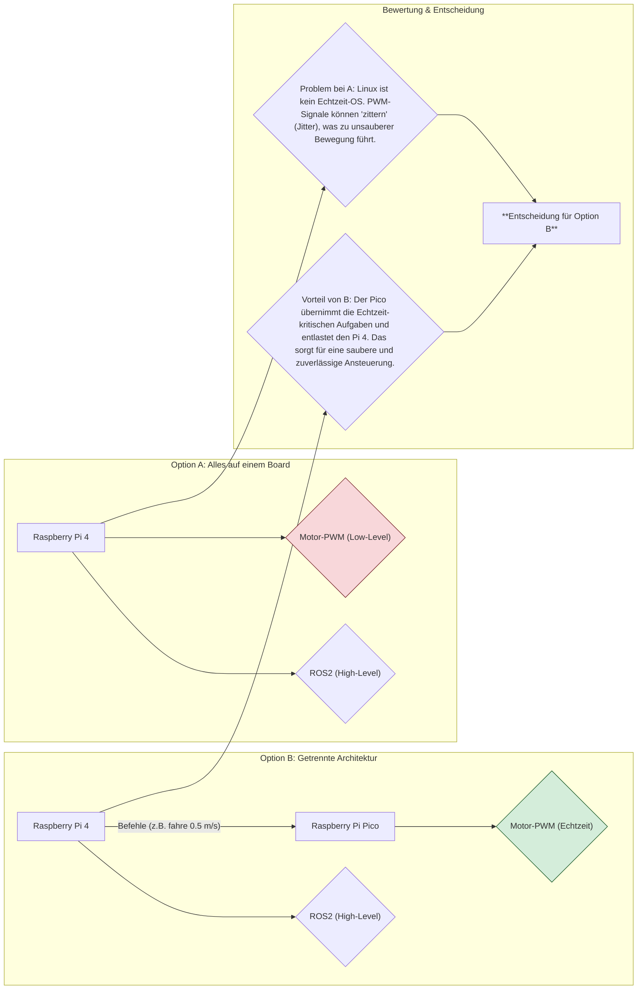

# **Projektbeschreibung: Omnidirektionaler ROS2-Roboter (V0.9)**

## 1\. Motivation & Projektidee

Alles begann mit der Leidenschaft für Robotik aus dem Mechatronik-Studium und dem enormen Spaß am Coden, den ich bei der Entwicklung von Fullstack-Webanwendungen für meinen Arbeitgeber entdeckt habe. Nach zwei erfolgreichen Web-Projekten wollte ich endlich etwas umsetzen, das beide Welten – komplexe Software und anspruchsvolle Hardware – verbindet. Da fertige Roboter-Kits nicht nur teuer sind, sondern ich auch langjährige Erfahrung im 3D-Druck habe, war die Entscheidung für ein komplett selbst entwickeltes ("self-sourced") Projekt schnell gefallen.

Die Idee war also geboren: Ein Roboter, der mehr kann als nur vor und zurück fahren. Er sollte autonom navigieren, Objekte und Personen erkennen und **sich präzise fernsteuern lassen.** Diese Idee der Fernsteuerung wurde stark durch meine Erfahrungen aus einem **5G-Forschungsprojekt** geprägt, wo ich die Testleitung für automatisiertes und teleoperiertes Fahren begleiten durfte. Der Austausch mit den Entwicklern eines straßenzugelassenen automatischen Kraftfahrzeugs und die Inspiration durch die Steuerzentralen für Flottenfahrzeuge und Luftfahrzeuge haben mir gezeigt, was in diesem Bereich möglich ist. Und um dem Ganzen noch eine persönliche und humorvolle Note zu geben, kam ich auf die Idee mit dem Nerf-Dart-Launcher – inspiriert von diesem super lustigen Video: [https://www.youtube.com/watch?v=8RKy\_i2h\_j8\&t=789s](https://www.youtube.com/watch?v=8RKy_i2h_j8&t=789s). Es ging mir darum, tief in die Programmierung einzutauchen und zu lernen, wie man Hardware und Software zu einem intelligenten System kombiniert.

-----

## 2\. Erste Ideen – Die unsortierte Wunschliste

Ganz am Anfang stand noch kein technischer Plan, sondern nur eine Sammlung von Vorstellungen, was der Roboter können sollte. Aber natürlich kannte ich all die fancy Buzzwords aus den Medien und Social Media – **SLAM, Face Recognition, Object Recognition, Path Planning, Autonomous Driving, Computer Vision** – und es war klar: Ich wollte all den coolen Shit haben\! Ich wusste bei vielen Dingen noch nicht im Detail, wie ich sie umsetzen würde, aber grundlegend wusste ich, was es ist, was es macht und wie es technisch grob funktioniert.

Die unsortierte Wunschliste sah also so aus:

* **Antrieb mit vier Rädern:** Von Anfang an stand für mich fest, dass die Bewegung mit 4 angetriebenen Rädern stattfinden muss. Das war nicht nur eine Abweichung von der Norm, sondern auch die Vorstellung, mehr Traktion, mehr Stabilität und einfach eine solidere Basis für all die geplanten Features zu haben.
* **Intelligenz statt Dummheit:** Er sollte nicht einfach nur Befehle ausführen und gegen das nächste Tischbein fahren, sondern seine Umgebung selbstständig wahrnehmen und sich darin orientieren können.
* **Interaktion statt nur Herumfahren:** Der Roboter sollte nicht nur ein passives Fahrzeug sein, sondern auch aktiv etwas tun können – eine sichtbare, interaktive Funktion haben.
* **Eine "persönliche" Note:** Haben wir nicht alle auf die große KI-Integration gewartet, bei der man tiefgründige Gespräche mit seinem Roboter führt? Genau das wollte ich nicht. Die Idee war eher, ihm lustige Sprüche beizubringen, die er einem im passenden Moment zuruft, oder ihn auf einfache Sprachbefehle reagieren zu lassen. Mehr Persönlichkeit, weniger "Skynet". 😉
* **Volle Kontrolle und Übersicht:** Ich wollte ihn nicht nur wie ein ferngesteuertes Auto fahren, sondern auch jederzeit sehen, was er "denkt" – also Zugriff auf all seine Sensordaten und seinen Zustand haben, fast wie in einem Kontrollzentrum.
* **Ein häufig genutztes Industrie-Fundament:** Das Ganze sollte nicht in einer Datei mit 10.000 Zeilen Code auf Arduino-Basis stehen, sondern auf einer Software-Architektur, die auch in der Industrie für Automatisierung und Robotik verwendet wird.

-----

## 3\. Konkretisierung der Vision

Aus dieser unsortierten Wunschliste wurden dann nach und nach die konkreten Kernfunktionen des Projekts geformt.

Meine erste Entscheidung, die aus der Idee einer Bewegung mit vier Rädern entstand, war tatsächlich eine aus Trotz (oder nennen wir es Experimentierfreude 😉): **Es mussten vier Räder und vier Motoren sein\!** Viele DIY-Projekte setzen auf den weit verbreiteten Differentialantrieb mit zwei Motoren. Ich wollte aber nicht die nächste Kopie des TurtleBots entwickeln.

Die vage Vorstellung von "Intelligenz", angetrieben durch die Buzzwords, wurde zur klaren Anforderung, dass der Roboter sich in meiner Wohnung zurechtfinden, selbstständig eine Karte erstellen und immer genau wissen muss, wo er ist. Damit war das Ziel **SLAM (Simultaneous Localization and Mapping)** gesetzt.

Aus dem Wunsch nach "Interaktion" und den Schlagwörtern "Face Recognition" wurde die konkrete Idee mit dem **Nerf-Dart-Launcher**. Das Ziel war, ernste Technik wie **Computer Vision zur Gesichtserkennung** zu nehmen und sie mit einem interaktiven, greifbaren und lustigen Feature zu verbinden.

Die Anforderung der "vollen Kontrolle" wurde weiter präzisiert: Die Steuerung findet **immer remote** statt, sei es manuell oder durch autonome Befehle. Außerdem war klar, dass die **Steuerung des Nerf-Launchers komplett getrennt von der Fahrsteuerung** erfolgen muss, um eine saubere und modulare Architektur zu gewährleisten. Das mündete in die Ziele einer direkten **Fernsteuerung per Xbox-Controller** und einem **Web-Dashboard** zur Visualisierung aller Telemetriedaten.

Und das "professionelle Fundament"? Da gab es keine Diskussion: Das Projekt musste von Anfang an auf **ROS2** aufbauen.

-----

## 4\. Recherche & Konzeptentscheidung

Nachdem klar war, *was* der Roboter können soll, ging die eigentliche Arbeit los: *Wie* zum Teufel setzt man das alles um? Dieser Prozess war eine Abfolge von Recherchen und Entscheidungen für jede Kernfunktion.

### 4.1. Recherche: Antriebskonzept

Die Entscheidung für vier Räder öffnete die Tür zu verschiedenen Antriebskonzepten. Aus meiner KFZ-Ausbildung war ich zwar mit "Steering"-Konzepten bestens vertraut, aber was gab das Roboter-Framework noch so her?

### 4.2. Recherche: Sensorik für SLAM

Für die autonome Navigation musste der Roboter seine Umgebung "sehen" können. Die Frage war: womit?

### 4.3. Recherche: Steuerungsarchitektur

Die Kombination aus rechenintensivem ROS2 und der Notwendigkeit einer präzisen, ruckelfreien Motoransteuerung warf die Frage nach der Systemarchitektur auf.

-----

## 5\. Systemarchitektur

Die Architektur des Roboters ist modular aufgebaut und nutzt die Stärken verschiedener Controller für spezifische Aufgaben. Die Kommunikation zwischen den Komponenten erfolgt durchgängig über das ROS2-Netzwerk, wobei **micro-ROS** als Brücke zu den Mikrocontrollern dient.

### 5.1. High-Level-Steuerung (Das Gehirn)

* **Komponente:** Raspberry Pi 4B (8GB)
* **Software:** Ubuntu Server, ROS2 Humble
* **Aufgaben:** Der Pi 4 ist der zentrale Knotenpunkt des ROS2-Systems und verantwortlich für alle rechenintensiven Aufgaben:
  * **Verarbeitung der Daten** von LiDAR und Kamera.
  * **Ausführung der SLAM-Algorithmen** zur Kartenerstellung und Lokalisierung.
  * **Pfadplanung** für die autonome Navigation.
  * **Hosting des Web-Dashboards** und der ROS2-Web-Bridge.
  * **Ausführung der Computer-Vision-Software** zur Gesichtserkennung.
* **Kommunikation:** Der Pi 4 betreibt den **`micro-ros-agent`**, der eine nahtlose Brücke zwischen dem Haupt-ROS2-Netzwerk und den angebundenen Mikrocontrollern (micro-ROS Clients) herstellt. Alle Befehle und Sensordaten werden über ROS2-Topics ausgetauscht.

### 5.2. Low-Level Echtzeit-Steuerung (Das Rückgrat)

* **Komponente:** Raspberry Pi Pico
* **Software:** FreeRTOS, micro-ROS Client
* **Aufgaben:** Der Pico ist als harter Echtzeit-Knoten für die gesamte Bewegungssteuerung und die dazugehörige Sensorik zuständig:
  * **Ansteuerung der 4 Motoren** inklusive Auslesen der **Encoder**.
  * **Auslesen der IMU- und ToF-Sensordaten.**
  * **Veröffentlichung der Sensor- und Odometrie-Daten** auf ROS2-Topics.
  * **Abonnieren von Bewegungsbefehlen** (Typ `geometry_msgs/Twist`), die vom Pi 4 oder einem Remote-PC gesendet werden.

### 5.3. Aktor-Steuerung (Der Schütze)

* **Komponente:** Arduino Nano oder Pro Micro
* **Software:** micro-ROS Client
* **Aufgaben:** Dieser dedizierte Mikrocontroller ist ausschließlich für die Steuerung des **Nerf-Launchers** verantwortlich. Dies entkoppelt die interaktive Funktion von der kritischen Bewegungssteuerung.
  * Ansteuerung der **Pan/Tilt-Servos**.
  * Steuerung der **Flywheel-Motoren** zum Beschleunigen der Darts.
  * Auslösen des **Abzugsmechanismus**.
  * Abonniert Ziel- und Feuerbefehle von einem eigenen ROS2-Topic.

### 5.4. Remote-Steuerung (Die Kommandozentrale)

* **Komponente:** Externer PC
* **Aufgaben:** Sowohl die manuelle Steuerung als auch die Überwachung finden nicht direkt am Roboter, sondern von einer Remote-Workstation aus statt.
  * Der **Xbox-Controller** ist mit dem PC verbunden. Eine ROS2-Node auf dem PC wandelt die Controller-Eingaben in `Twist`-Nachrichten um und sendet sie über das WLAN an den Roboter.
  * Das **Web-Dashboard** wird im Browser auf dem PC aufgerufen und kommuniziert über die ROS2-Web-Bridge mit dem Roboter, um Telemetriedaten anzuzeigen und Befehle zu senden.

-----

## 6\. Technische Komponenten

Die folgende Tabelle listet die zentralen Hardwarekomponenten auf, die auf Basis des Rechercheprozesses ausgewählt wurden, um die definierte Systemarchitektur umzusetzen.

| **Kategorie**             | **Komponente**                                       | **Zweck**                                                             |
| :------------------------ | :--------------------------------------------------- | :-------------------------------------------------------------------- |
| **Chassis & Antrieb**     | 4x DC-Getriebemotoren (GM3865-520) mit Hall-Encodern | Kraftvoller Antrieb und Feedback zur Raddrehung                       |
|                           | 4x 80mm Mecanum-Räder                                | Ermöglichen die omnidirektionale Bewegung                             |
|                           | 4x TB6612FNG Motortreiber                            | Ansteuerung der DC-Motoren                                            |
| **Steuerung & Sensorik**  | Raspberry Pi 4B (8GB)                                | High-Level-Steuerung, ROS2, Computer Vision                           |
|                           | Raspberry Pi Pico                                    | Low-Level-Steuerung (Motoren, Encoder, IMU, ToF)                      |
|                           | Arduino Nano / Pro Micro                             | Dedizierte Steuerung des Nerf-Launchers                               |
|                           | Lidar LDS01RR                                        | 360°-Umgebungsscans für SLAM                                          |
|                           | ICM-20948 (9-DoF IMU)                                | Erfassung von Beschleunigung, Rotation und Ausrichtung (Sensorfusion) |
|                           | VL53L0X Time-of-Flight-Sensor                        | Präzise Abstandsmessung für Hinderniserkennung                        |
|                           | USB-Kamera (1080p)                                   | Video-Streaming und Input für die Gesichtserkennung                   |
| **Nerf-Launcher**         | 2x RS2205 Brushless-Motoren & 2x 40A ESCs            | Beschleunigung der Nerf-Darts                                         |
|                           | 1x Digital-Servo (22kg) & 1x 9g Servo                | Zielen des Launchers (Pan/Tilt)                                       |
| **Energieversorgung**     | 3S Li-Ion Akku-Pack (18650 Zellen)                   | Mobile Stromversorgung                                                |
|                           | 3S Batterieschutzplatine (BMS)                       | Schutz vor Überladung, Tiefentladung und Kurzschluss                  |
|                           | INA3221 Sensor                                       | Überwachung von Spannung und Stromverbrauch                           |
| **Bedienung & Interface** | Xbox Controller (am Remote-PC)                       | Manuelle Fernsteuerung                                                |
|                           | Web-Dashboard (am Remote-PC)                         | Telemetrie und Steuerung                                              |

<!-- @startuml
title Antriebskonzept (4 Räder)

start
if ("Bewegungsart?") then ("holonom\n(max. Manövrierfähigkeit)")
  :Omnidirektionale Antriebe;
  if ("Untergrund?") then ("glatt/Indoor")
    :Mecanum-Räder;
  else ("uneben")
    :Omni-Räder;
  endif
else ("nicht-holonom\n(fahrzeugähnlich)")
  :Gelenkte / starre Antriebe;
  fork
    :Skid-Steer;
  fork again
    :Ackermann-Lenkung;
  end fork
endif

:Entscheidung:\nMecanum-Antrieb für Indoor-Agilität;
stop
@enduml
 -->

<!-- @startuml
title Sensorik für SLAM

start
if ("Sensor für SLAM?") then ("LiDAR")
  :LiDAR; #LightBlue
  note right
    + Hohe Präzision (2D)
    + 360° Abdeckung
    + Unempfindlich gegen Licht
    - Kosten
  end note
elseif ("Tiefenkamera")
  :Tiefenkamera (Stereo/ToF);
  note right
    + Günstiger
    + Echte 3D-Daten
    - Begrenztes Sichtfeld
    - Lichtanfällig
  end note
else ("Ultraschall")
  :Ultraschall;
  note right
    + Sehr günstig
    - Zu ungenau für SLAM
    - Nur Hinderniserkennung
  end note
endif

:Entscheidung:\nLiDAR als Basis für robustes 2D-Mapping;
stop
@enduml
 -->

 <!-- @startuml
title Steuerungsarchitektur (ROS2 vs. PWM Echtzeit)

start
if ("Architekturwahl?") then ("Option A:\nAlles auf einem Board")
  :Raspberry Pi 4\nROS2 (High-Level)\n+ Motor-PWM (Low-Level);
  note right
    Problem: Linux ist kein Echtzeit-OS.
    PWM-Jitter → unsaubere Bewegung.
  end note
else ("Option B:\nGetrennte Architektur")
  :Pi 4 → ROS2 (High-Level);\nPico → Motor-PWM (Echtzeit);
  note right
    Vorteil: Echtzeitkritik auf Pico.
    Pi 4 entlastet. Saubere Ansteuerung.
  end note
endif

:Entscheidung:\nOption B gewählt;
stop
@enduml -->