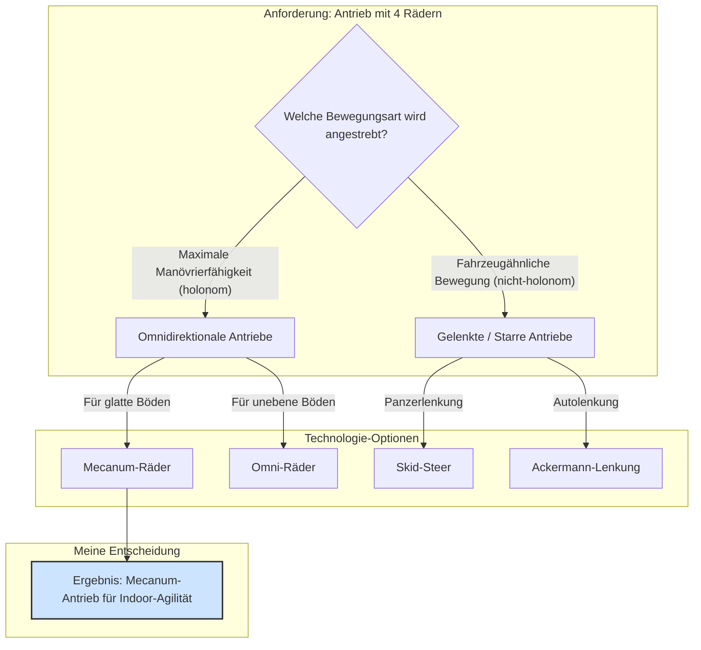
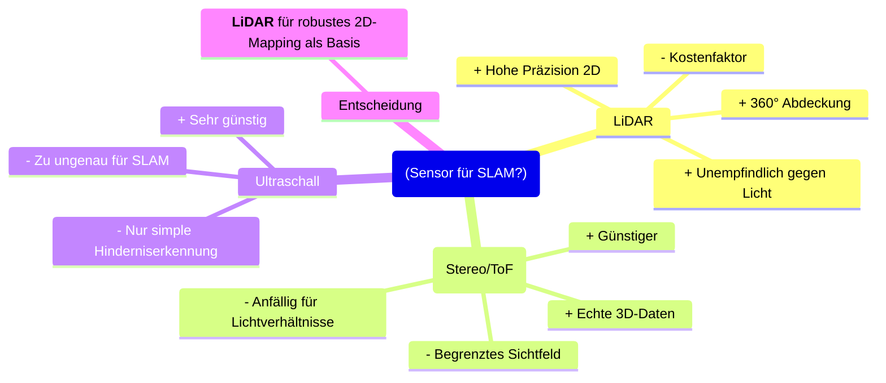
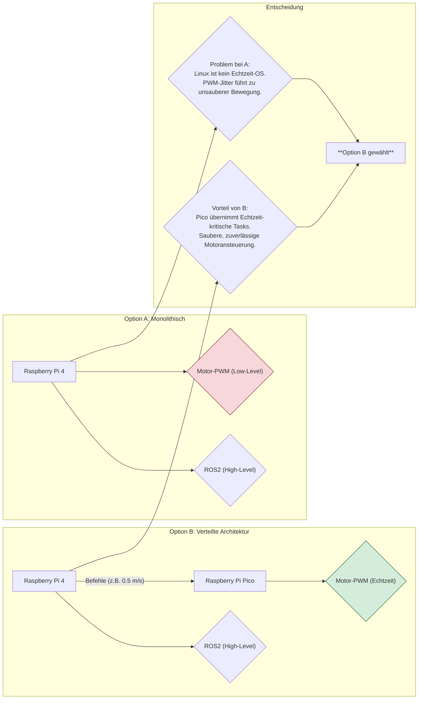

# **Projektbeschreibung: ROS2-Roboter**

## 1. Motivation & Projektidee

Dieses Projekt vereint zwei Leidenschaften: die Begeisterung für Robotik aus dem Mechatronik-Studium und die Freude am Programmieren, die ich bei der Entwicklung von Fullstack-Webanwendungen für meinen Arbeitgeber entdeckt habe. Nach zwei erfolgreichen Web-Projekten wollte ich endlich etwas schaffen, das beide Welten verbindet – komplexe Software und anspruchsvolle Hardware.

Da fertige Roboter-Kits nicht nur teuer sind, sondern ich auch langjährige Erfahrung im 3D-Druck mitbringe, fiel die Entscheidung schnell: ein komplett "self-sourced" entwickeltes Projekt.

### Die Vision

Die Idee war klar: Ein Roboter, der mehr kann als nur vor und zurück zu fahren. Er sollte:

- Autonom navigieren und Hindernissen ausweichen
- Objekte und Personen erkennen
- Sich präzise fernsteuern lassen

Die Idee der Fernsteuerung wurde stark durch meine Erfahrungen aus einem **5G-Forschungsprojekt** geprägt, in dem ich die Testleitung für automatisiertes und teleoperiertes Fahren begleiten durfte. Der Austausch mit Entwicklern straßenzugelassener autonomer Fahrzeuge und die Inspiration durch Flottensteuerungs- und Luftfahrt-Kontrollzentralen zeigten mir, was in diesem Bereich möglich ist.

Und um dem Ganzen eine persönliche und humorvolle Note zu geben, kam die Idee mit dem **Nerf-Dart-Launcher** – inspiriert von [diesem super lustigen Video](https://www.youtube.com/watch?v=8RKy_i2h_j8&t=789s). Es ging mir darum, tief in die Programmierung einzutauchen und zu lernen, wie man Hardware und Software zu einem intelligenten System kombiniert.

---

## 2. Von der Idee zum Konzept

### 2.1. Die initiale Wunschliste

Am Anfang stand keine detaillierte Planung, sondern nur eine Sammlung von Ideen und den üblichen Buzzwords aus Medien und Social Media: **SLAM, Face Recognition, Object Recognition, Path Planning, Autonomous Driving, Computer Vision**. Ich wollte all den coolen Shit haben!

Die unsortierte Wunschliste:

- **Vier angetriebene Räder** – nicht die Standard-Zwei-Rad-Lösung, sondern mehr Traktion, Stabilität und eine solidere Basis
- **Autonome Intelligenz** – keine stumpfe Befehlsausführung, sondern Umgebungswahrnehmung und Selbstorientierung
- **Interaktion** – ein greifbares, sichtbares Feature statt nur Herumfahren
- **Persönlichkeit** – keine tiefgründigen KI-Gespräche, sondern lustige Sprüche und einfache Sprachbefehle
- **Volle Kontrolle** – kompletter Zugriff auf Sensordaten und Systemzustand wie in einer Kontrollzentrale
- **Industriestandard** – keine 10.000-Zeilen-Arduino-Datei, sondern eine professionelle Robotik-Architektur

### 2.2. Konkretisierung der Funktionen

Aus diesen vagen Vorstellungen wurden klare, technische Anforderungen:

**Antrieb:**  
Vier Räder waren gesetzt – und zwar aus Trotz gegenüber den zahlreichen TurtleBot-Kopien mit Differentialantrieb. Ich wollte etwas Eigenes entwickeln.

**SLAM:**  
Die "Intelligenz" konkretisierte sich zur Anforderung, dass der Roboter in meiner Wohnung autonom eine Karte erstellen, sich darin lokalisieren und navigieren können muss.

**Computer Vision:**  
Der Wunsch nach "Interaktion" mündete in der Kombination aus **Gesichtserkennung** und dem **Nerf-Dart-Launcher** – ernste Technik mit einem spielerischen, greifbaren Feature.

**Fernsteuerung:**  
Die Steuerung sollte **immer remote** erfolgen – manuell per Xbox-Controller oder durch autonome Befehle. Die Launcher-Steuerung musste dabei **vollständig getrennt** von der Fahrsteuerung sein, um eine saubere, modulare Architektur zu gewährleisten. Ein **Web-Dashboard** zur Visualisierung der Telemetriedaten war ebenfalls Pflicht.

**Technologiebasis:**  
Von Anfang an stand fest: Das Projekt baut auf **ROS2** auf.

---

## 3. Recherche & Konzeptentscheidungen

Nachdem klar war, *was* der Roboter können soll, begann die eigentliche Arbeit: *Wie* setze ich das alles um?

### 3.1. Antriebskonzept

Die Entscheidung für vier Räder eröffnete verschiedene Antriebskonzepte. Aus meiner KFZ-Ausbildung kannte ich klassische Lenkungen, doch welche Optionen bietet die Robotik?

**Entscheidung:** Mecanum-Räder bieten holonome Bewegung (seitliches Fahren, Rotation auf der Stelle) und sind ideal für Indoor-Umgebungen mit glatten Böden.

### 3.2. Sensorik für SLAM

Für die autonome Navigation muss der Roboter seine Umgebung erfassen. Die Optionen:

**Entscheidung:** LiDAR bietet die beste Balance aus Präzision, Zuverlässigkeit und 360°-Abdeckung für robustes Indoor-SLAM.

### 3.3. Steuerungsarchitektur

Die Kombination aus rechenintensivem ROS2 und präziser Motoransteuerung stellte eine zentrale Herausforderung dar.

**Entscheidung:** Getrennte Architektur mit Raspberry Pi 4 für High-Level-Logik und Raspberry Pi Pico für echtzeitkritische Motorsteuerung.

---

## 4. Systemarchitektur

Die finale Architektur ist modular aufgebaut und nutzt die Stärken verschiedener Controller für spezifische Aufgaben. Die Kommunikation erfolgt durchgängig über das ROS2-Netzwerk, wobei **micro-ROS** als Brücke zu den Mikrocontrollern dient.

### 4.1. High-Level-Steuerung (Das Gehirn)

**Hardware:** Raspberry Pi 4B (8GB)  
**Software:** Ubuntu Server 22.04 LTS, ROS2 Humble  

**Verantwortlichkeiten:**

- Verarbeitung von LiDAR- und Kameradaten
- Ausführung der SLAM-Algorithmen (Kartierung & Lokalisierung)
- Pfadplanung für autonome Navigation
- Hosting des Web-Dashboards und der ROS2-Web-Bridge
- Computer-Vision-Verarbeitung für Gesichtserkennung
- Betrieb des **`micro-ros-agent`** für die Kommunikation mit Mikrocontrollern

### 4.2. Low-Level Echtzeit-Steuerung (Das Rückgrat)

**Hardware:** Raspberry Pi Pico  
**Software:** FreeRTOS, micro-ROS Client  

**Verantwortlichkeiten:**

- Ansteuerung der 4 DC-Motoren mit PWM
- Auslesen der Hall-Encoder für Odometrie
- Erfassung der IMU-Daten (Beschleunigung, Rotation, Orientierung)
- Auslesen der Time-of-Flight-Sensoren
- Veröffentlichung von Sensordaten und Odometrie auf ROS2-Topics
- Verarbeitung von `geometry_msgs/Twist`-Bewegungsbefehlen

### 4.3. Aktor-Steuerung (Der Schütze)

**Hardware:** Arduino Nano oder Pro Micro  
**Software:** micro-ROS Client  

**Verantwortlichkeiten:**

- Steuerung der Pan/Tilt-Servos für Zielausrichtung
- Ansteuerung der Brushless-Motoren (Flywheel) zum Dart-Beschleunigen
- Auslösen des Abzugsmechanismus
- Verarbeitung von Ziel- und Feuerbefehlen über dedizierte ROS2-Topics

**Design-Prinzip:** Vollständige Entkopplung von der kritischen Bewegungssteuerung für Modularität und Ausfallsicherheit.

### 4.4. Remote-Steuerung (Die Kommandozentrale)

**Hardware:** Externer PC (Remote Workstation)  

**Funktionen:**

- **Manuelle Steuerung:** Xbox-Controller am PC verbunden, ROS2-Node wandelt Eingaben in `Twist`-Nachrichten um
- **Telemetrie & Monitoring:** Web-Dashboard im Browser mit Echtzeit-Visualisierung über ROS2-Web-Bridge
- **Kommandosteuerung:** Senden von autonomen Navigationsbefehlen und Launcher-Kommandos

---

## 5. Hardware-Komponenten

### 5.1. Komponenten-Übersicht

| **Kategorie**             | **Komponente**                                     | **Funktion**                                             |
| :------------------------ | :------------------------------------------------- | :------------------------------------------------------- |
| **Chassis & Antrieb**     | 4× DC-Getriebemotoren GM3865-520 mit Hall-Encodern | Kraftvoller Antrieb mit Drehzahl-Feedback                |
|                           | 4× Mecanum-Räder (80mm)                            | Omnidirektionale Bewegung                                |
|                           | 4× TB6612FNG Motortreiber                          | H-Brücken-Ansteuerung der DC-Motoren                     |
| **Steuerung & Sensorik**  | Raspberry Pi 4B (8GB RAM)                          | High-Level-Steuerung, ROS2-Master, Computer Vision       |
|                           | Raspberry Pi Pico                                  | Echtzeit-Steuerung (Motoren, Encoder, IMU, ToF)          |
|                           | Arduino Nano / Pro Micro                           | Dedizierte Launcher-Steuerung                            |
|                           | YDLIDAR LDS01RR                                    | 360° Laser-Scanner für SLAM (8m Reichweite)              |
|                           | ICM-20948 (9-DoF IMU)                              | Lage- und Bewegungssensorik (Sensorfusion mit Odometrie) |
|                           | VL53L0X Time-of-Flight-Sensor                      | Präzise Distanzmessung (bis 2m) für Kollisionsvermeidung |
|                           | USB-Kamera (1080p)                                 | Video-Streaming und Computer-Vision-Input                |
| **Nerf-Launcher**         | 2× RS2205 Brushless-Motoren & 2× 40A ESCs          | Dart-Beschleunigung (Flywheel-System)                    |
|                           | 1× Digital-Servo (22kg) & 1× 9g Servo              | Pan/Tilt-Mechanismus für Zielausrichtung                 |
| **Energieversorgung**     | 3S Li-Ion Akku-Pack (18650-Zellen)                 | Mobile Stromversorgung (11,1V nominal)                   |
|                           | 3S BMS (Battery Management System)                 | Lade-/Entladeschutz, Zellenbalancierung                  |
|                           | INA3221 Sensor                                     | Echtzeit-Monitoring von Spannung, Strom und Leistung     |
| **Bedienung & Interface** | Xbox Controller (Remote-PC)                        | Präzise, intuitive manuelle Fernsteuerung                |
|                           | Web-Dashboard (Remote-PC)                          | Telemetrie-Visualisierung und Systemsteuerung            |

### 5.2. Systemübersicht-Diagramme

#### Komponenten-Architektur

#### Datenfluss & Kommunikation

#### Deployment-Architektur

---

## 6. Software-Stack & ROS2-Integration

### 6.1. ROS2-Architektur

Das System basiert vollständig auf **ROS2 Humble** und nutzt dessen modulare, verteilte Architektur.

**Zentrale ROS2-Nodes:**

- **`base_controller`** (Pico): Motorsteuerung, Odometrie-Publikation
- **`slam_toolbox`** (Pi 4): SLAM-Algorithmus für Kartierung
- **`nav2`** (Pi 4): Navigations-Stack für Pfadplanung
- **`face_recognition_node`** (Pi 4): Computer-Vision-Verarbeitung
- **`launcher_controller`** (Arduino): Nerf-Launcher-Steuerung
- **`teleop_node`** (Remote-PC): Controller-Input-Verarbeitung
- **`web_bridge`** (Pi 4): ROS2-Web-Interface

**Kommunikation:**

- **DDS** (Data Distribution Service) für Peer-to-Peer-Kommunikation
- **micro-ROS** für Mikrocontroller-Integration
- **rosbridge** für Web-Dashboard-Verbindung

### 6.2. Entwicklungs-Workflow

**Version Control:** Git mit Feature-Branch-Workflow  
**Build-System:** Colcon (ROS2-Standard)  
**Testing:** Unit-Tests mit `pytest`, Integration-Tests mit `launch_testing`  
**Deployment:** Custom `docker-compose` Setup für Pi 4

---

## 7. Kernfunktionen im Detail

### 7.1. SLAM & Navigation

**Algorithmus:** SLAM Toolbox (Karto-basiert)  
**Sensor-Fusion:** LiDAR + Odometrie + IMU  
**Features:**

- Echtzeit-Kartierung unbekannter Umgebungen
- Persistente Karten-Speicherung
- Loop-Closure-Detection für Konsistenz
- Kostenkartenbasierte Pfadplanung mit dynamischer Hindernisvermeidung

### 7.2. Omnidirektionale Bewegung

**Kinematik:** Mecanum-Räder ermöglichen:

- Vorwärts/Rückwärts-Fahrt
- Seitwärts-Bewegung (Crabbing)
- Rotation auf der Stelle
- Diagonale Bewegungen
- Beliebige Kombinationen

**Regelung:** PID-Controller für jeden Motor mit Encoder-Feedback

### 7.3. Computer Vision & Launcher

**Face Recognition:**

- OpenCV + dlib für Gesichtserkennung
- Training mit bekannten Gesichtern
- Echtzeit-Tracking mit Bounding-Box-Publikation

**Launcher-Integration:**

- Automatisches Tracking erkannter Gesichter
- Manuelle Übersteuerung via Controller
- Sicherheits-Features (Reichweitenbegrenzung, Timeout)

### 7.4. Remote-Steuerung

**Manuelle Steuerung:**

- Xbox-Controller mit intuitiver Tastenbelegung
- Analog-Stick für omnidirektionale Bewegung
- Trigger für Launcher-Steuerung

**Web-Dashboard:**

- Live-Kamera-Stream
- Echtzeit-Karte mit Roboter-Position
- Sensordaten-Visualisierung (Batterie, IMU, ToF)
- Diagnose-Tools und Log-Anzeige

---

## 8. Lessons Learned & Ausblick

### 8.1. Herausforderungen

- **Mecanum-Kinematik:** Komplex, aber die Agilität ist jeden Debugging-Alptraum wert
- **micro-ROS-Integration:** Gewöhnungsbedürftig, aber die Performance-Vorteile sind enorm
- **Real-Time-Constraints:** FreeRTOS auf dem Pico war die richtige Entscheidung
- **Energiemanagement:** 3S-Akku reicht für ~45 Min. bei normalem Betrieb

### 8.2. Mögliche Erweiterungen

- **3D-Navigation:** Integration einer Tiefenkamera für Multi-Level-SLAM
- **Sprachsteuerung:** Wake-Word-Detection + Sprachbefehle
- **Objektmanipulation:** Greifarm für Pick-and-Place-Aufgaben
- **Schwarm-Verhalten:** Multi-Robot-System mit kooperativer Navigation
- **ML-basiertes Tracking:** YOLOv8 für robustere Objekterkennung