# Pico Firmware Architecture

## Overview

Real-time firmware for Raspberry Pi Pico running FreeRTOS with micro-ROS for ROS2 communication. Handles motor control, sensor reading, and odometry calculation.

## System Architecture

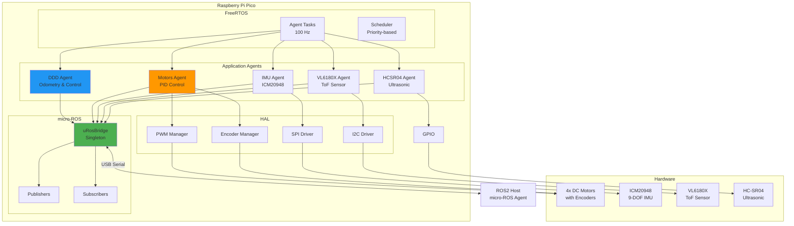

## Agent Architecture

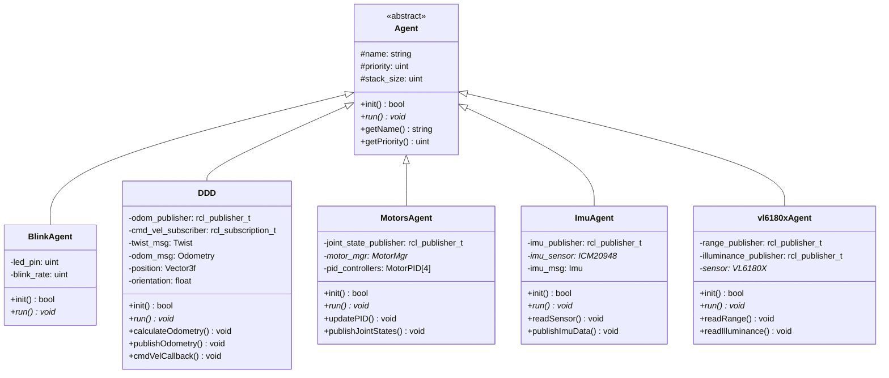

## Data Flow Diagram

```mermaid
flowchart TB
    subgraph "ROS2 Host"
        AGENT[micro-ROS Agent]
        CTRL[Controller]
    end
    
    subgraph "Pico Firmware"
        direction TB
        
        subgraph "micro-ROS Layer"
            UROS[uRosBridge]
            SUB[/rt/cmd_vel<br/>Subscriber]
            PUB_JS[/rt/joint_states<br/>Publisher]
            PUB_IMU[/rt/imu/data_raw<br/>Publisher]
            PUB_ODOM[/rt/odom<br/>Publisher]
            PUB_SENS[/rt/sensors/*<br/>Publishers]
        end
        
        subgraph "Control Layer"
            DDD_A[DDD Agent<br/>Odometry]
            MOTOR_A[Motors Agent<br/>PID Control]
        end
        
        subgraph "Sensor Layer"
            IMU_A[IMU Agent]
            TOF_A[ToF Agent]
        end
        
        subgraph "Hardware Layer"
            PWM_M[PWM Manager]
            ENC_M[Encoder Manager]
            SPI_D[SPI Driver]
            I2C_D[I2C Driver]
        end
    end
    
    subgraph "Hardware"
        MOTORS[DC Motors]
        ENCODERS[Encoders]
        IMU_HW[ICM20948]
        TOF_HW[VL6180X]
    end
    
    CTRL -->|/cmd_vel| AGENT
    AGENT <-->|USB Serial| UROS
    
    UROS --> SUB
    SUB --> DDD_A
    DDD_A --> MOTOR_A
    
    MOTOR_A --> PWM_M
    PWM_M --> MOTORS
    
    ENCODERS --> ENC_M
    ENC_M --> MOTOR_A
    MOTOR_A --> PUB_JS
    
    MOTOR_A --> DDD_A
    DDD_A --> PUB_ODOM
    
    IMU_HW --> SPI_D
    SPI_D --> IMU_A
    IMU_A --> PUB_IMU
    
    TOF_HW --> I2C_D
    I2C_D --> TOF_A
    TOF_A --> PUB_SENS
    
    PUB_JS --> UROS
    PUB_IMU --> UROS
    PUB_ODOM --> UROS
    PUB_SENS --> UROS
    
    UROS --> AGENT
    AGENT --> CTRL
```

## Sequence Diagram: Initialization

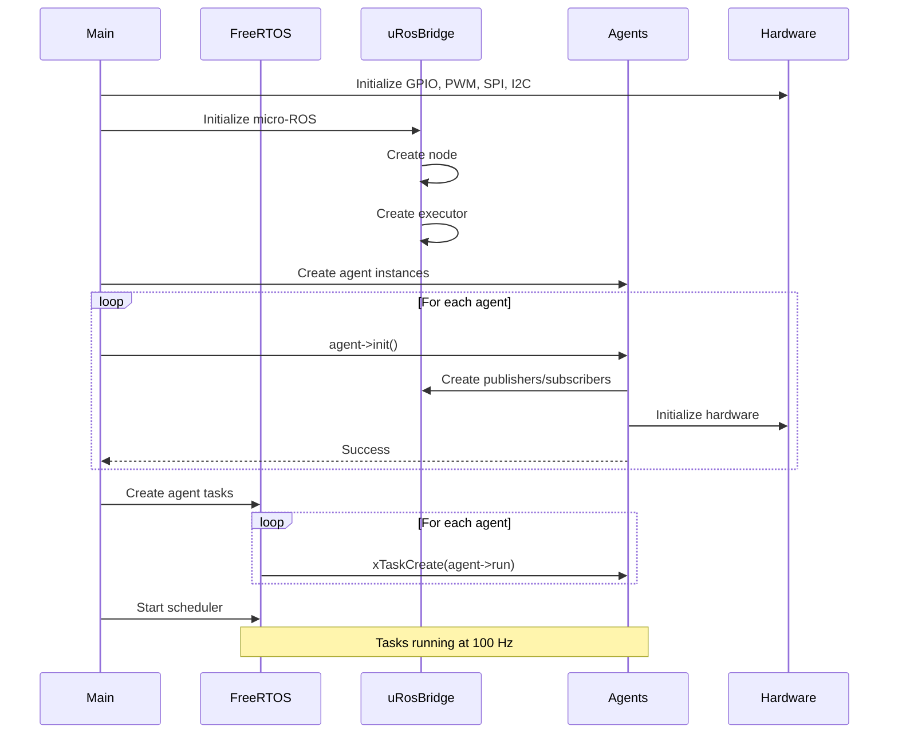

## Sequence Diagram: Control Loop

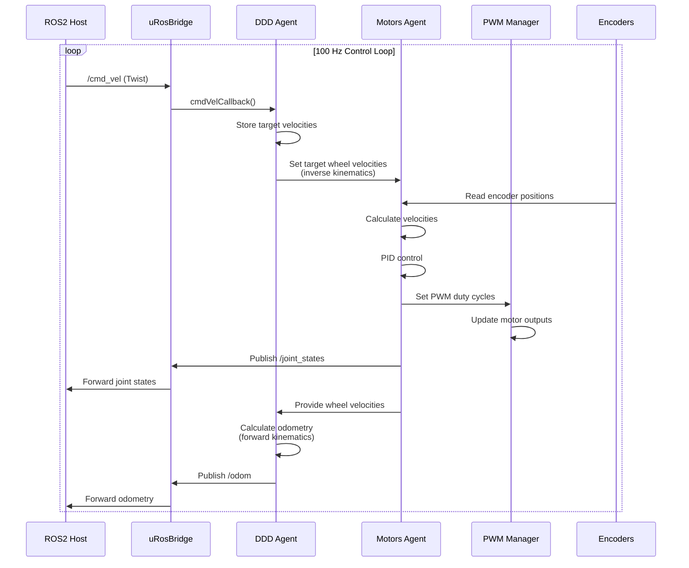

## Task Scheduling

```mermaid
gantt
    title FreeRTOS Task Scheduling (10ms period)
    dateFormat X
    axisFormat %L ms
    
    section High Priority
    Motors Agent (100Hz)    :0, 2
    DDD Agent (100Hz)       :2, 4
    
    section Medium Priority
    IMU Agent (50Hz)        :4, 6
    
    section Low Priority
    ToF Agent (Variable)    :6, 7
    Ultrasonic (Variable)   :7, 8
    Blink Agent (1Hz)       :8, 9
    
    section Idle
    Idle Task               :9, 10
```

## Memory Layout

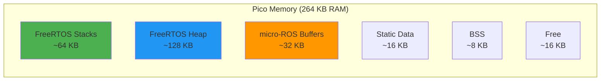

## Pin Configuration

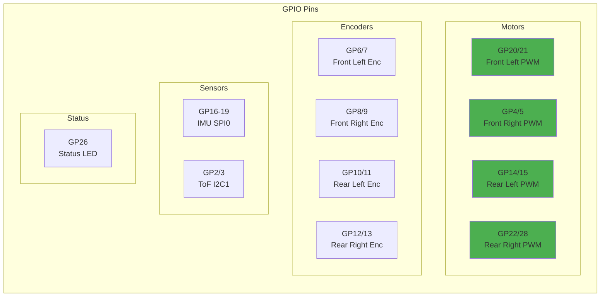

## PID Control Flow

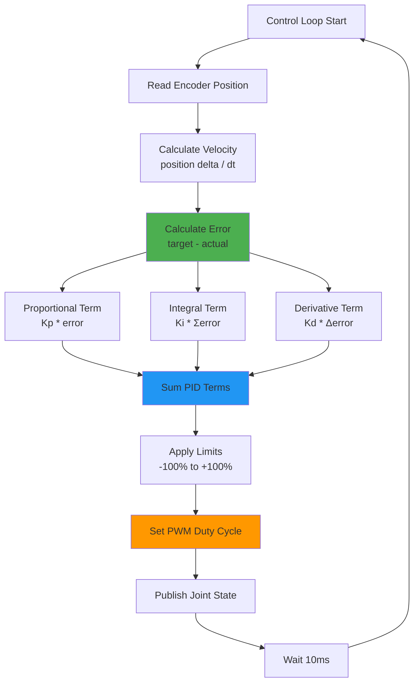

## Odometry Calculation

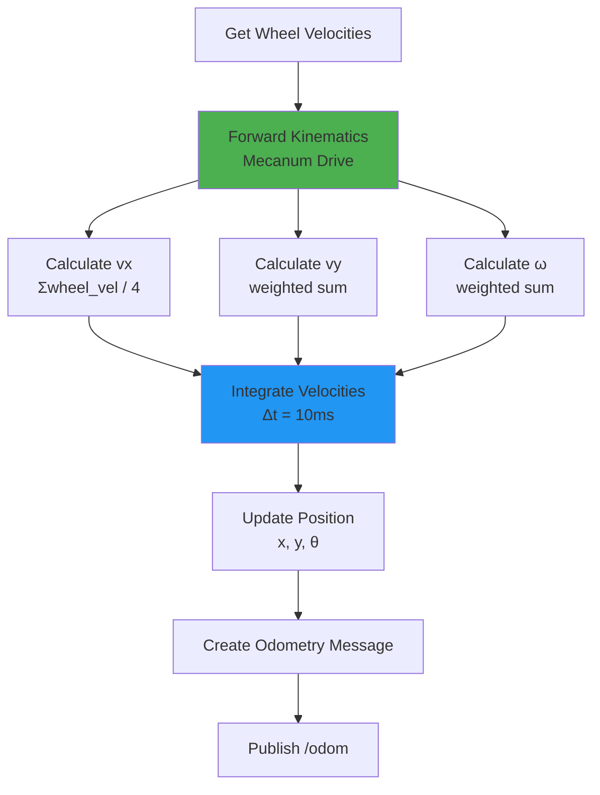

## Communication Protocol

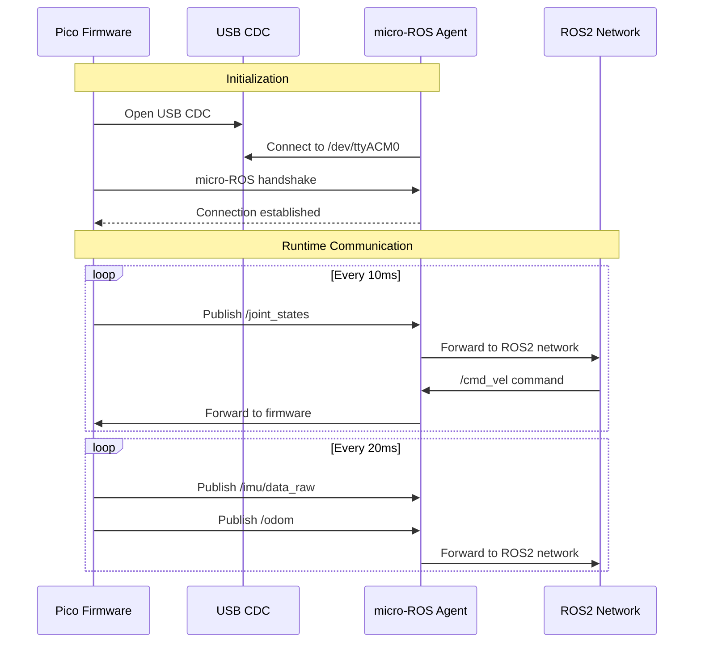

## Build System

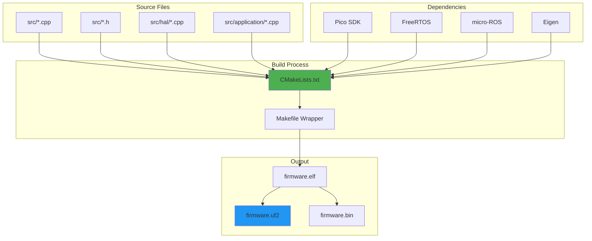

## Configuration Parameters

| Parameter | Location | Default | Description |
|-----------|----------|---------|-------------|
| Control Loop Rate | MotorsAgent | 100 Hz | PID update frequency |
| IMU Rate | ImuAgent | 50 Hz | IMU reading frequency |
| PID Gains (Kp, Ki, Kd) | MotorPID | Tuned | Per-motor PID parameters |
| Wheel Radius | DDD | 0.047 m | For odometry calculation |
| Wheel Base | DDD | 0.220 m | For odometry calculation |
| Encoder CPR | MotorMgr | 1440 | Counts per revolution |
| PWM Frequency | PWMManager | 20 kHz | Motor PWM frequency |

## Performance Characteristics

- **Control Loop**: 100 Hz (10 ms period)
- **IMU Reading**: 50 Hz (20 ms period)
- **Odometry Publishing**: 50 Hz
- **Joint States Publishing**: 100 Hz
- **USB Latency**: < 2 ms
- **PID Computation**: < 0.5 ms
- **Total CPU Usage**: ~60% (with all agents)

## Error Handling

| Error Condition | Detection | Action | Recovery |
|----------------|-----------|--------|----------|
| micro-ROS connection lost | Timeout | Log error, continue operation | Auto-reconnect |
| Encoder read failure | Invalid value | Use last valid value | Retry next cycle |
| IMU read failure | SPI error | Skip publish | Retry next cycle |
| Motor stall | Zero velocity despite command | Reduce PWM | Automatic |
| Watchdog timeout | No host communication | Stop motors | Wait for reconnect |

## Dependencies

- **Pico SDK**: Hardware abstraction, USB, GPIO
- **FreeRTOS**: Real-time task scheduling
- **micro-ROS**: ROS2 communication
- **Eigen**: Linear algebra for odometry

## Build Commands

```bash
# Debug build
cd firmware && make build

# Release build
cd firmware && make build_release

# Flash to Pico
make flash

# Monitor output
./monitor_firmware.sh

# Run tests
cd tests && mkdir -p build && cd build
cmake .. && make && ctest
```

## Troubleshooting

| Issue | Possible Cause | Solution |
|-------|---------------|----------|
| Firmware won't flash | Pico not in BOOTSEL mode | Hold BOOTSEL while connecting |
| No USB device | Driver issue | Check /dev/ttyACM* exists |
| Motors don't respond | PWM not initialized | Check pin configuration |
| Encoders not counting | Interrupt not working | Verify encoder connections |
| IMU data all zeros | SPI not working | Check SPI wiring |
| High CPU usage | Too many agents | Reduce agent frequencies |
