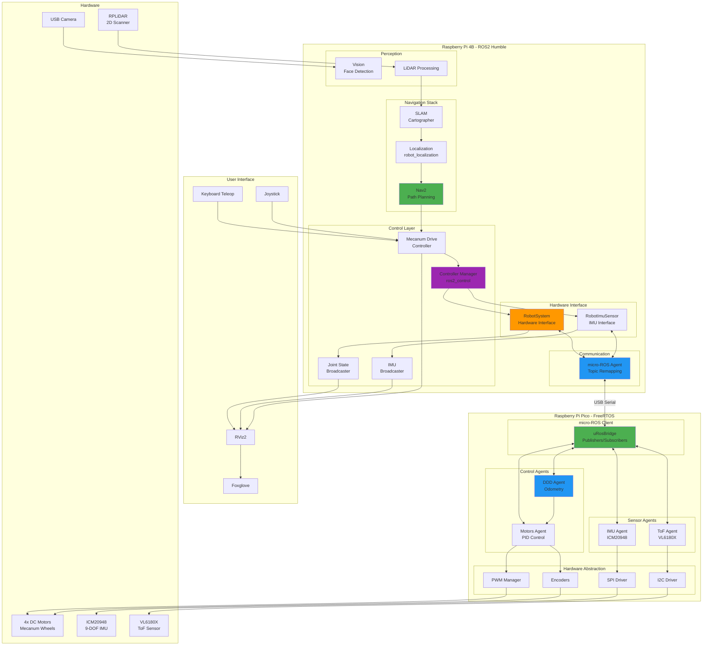
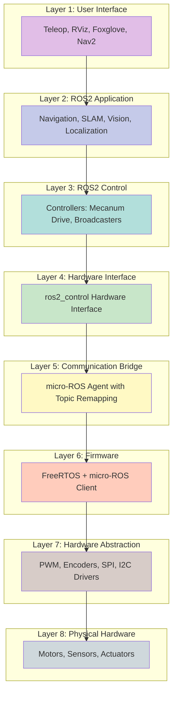
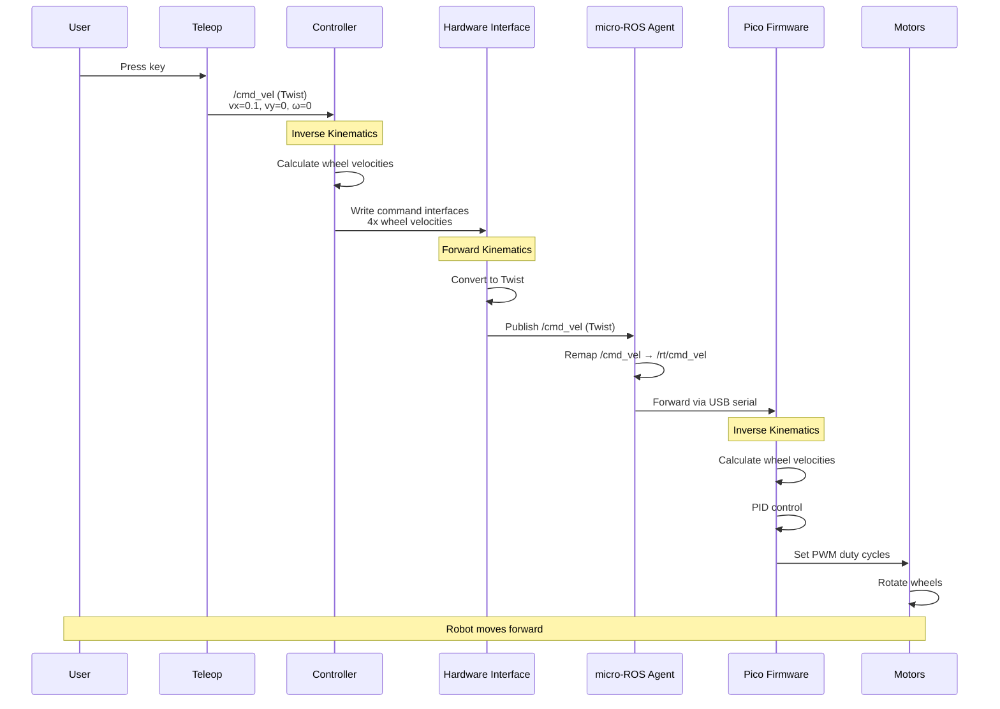
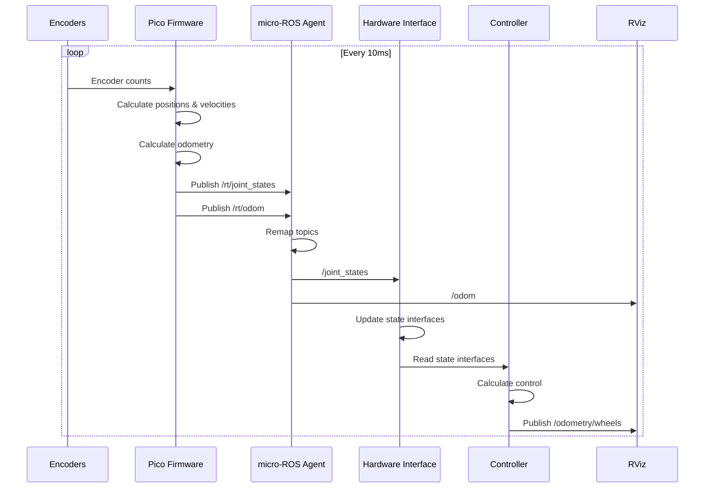
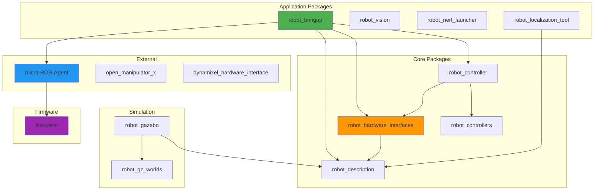
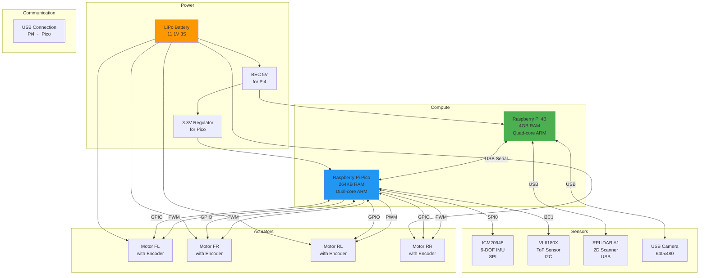
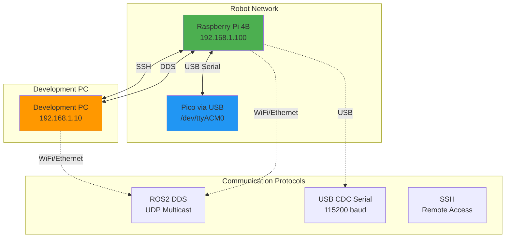
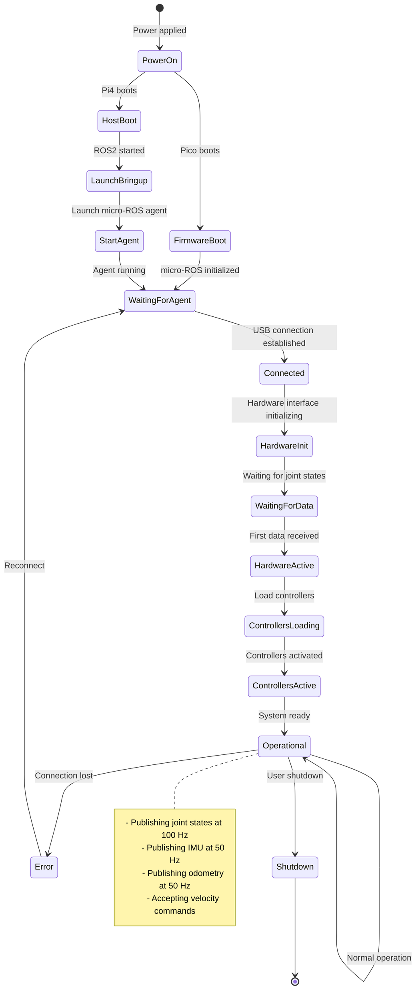

# System Architecture Overview

## Complete System Diagram



## Layered Architecture



## Data Flow: Command to Motion



## Data Flow: Sensor to State



## Topic Flow Diagram

```mermaid
flowchart LR
    subgraph "User Input"
        KB[Keyboard]
        JOY[Joystick]
        NAV[Nav2]
    end
    
    subgraph "Standard ROS2 Topics"
        CMD[/cmd_vel<br/>Twist]
        JS[/joint_states<br/>JointState]
        IMU[/imu/data_raw<br/>Imu]
        ODOM[/odom<br/>Odometry]
        ODOM_W[/odometry/wheels<br/>Odometry]
        SCAN[/scan<br/>LaserScan]
    end
    
    subgraph "micro-ROS Agent Remapping"
        RT_CMD[/rt/cmd_vel]
        RT_JS[/rt/joint_states]
        RT_IMU[/rt/imu/data_raw]
        RT_ODOM[/rt/odom]
    end
    
    subgraph "Firmware Topics"
        FW[Pico Firmware<br/>Publishers/Subscribers]
    end
    
    KB --> CMD
    JOY --> CMD
    NAV --> CMD
    
    CMD --> RT_CMD
    RT_CMD --> FW
    
    FW --> RT_JS
    FW --> RT_IMU
    FW --> RT_ODOM
    
    RT_JS --> JS
    RT_IMU --> IMU
    RT_ODOM --> ODOM
    
    JS --> ODOM_W
    
    style CMD fill:#4CAF50
    style JS fill:#2196F3
    style IMU fill:#FF9800
    style ODOM fill:#9C27B0
```

## Package Dependencies



## Hardware Architecture



## Network Architecture



## State Machine: System Lifecycle



## Performance Metrics

| Metric | Target | Actual | Notes |
|--------|--------|--------|-------|
| Control Loop Frequency | 100 Hz | 100 Hz | Firmware PID loop |
| Joint State Publishing | 100 Hz | 109.8 Hz | Measured |
| IMU Publishing | 50 Hz | 50 Hz | Firmware |
| Odometry Publishing | 50 Hz | 50 Hz | Firmware |
| Command Latency | < 20 ms | ~15 ms | End-to-end |
| USB Serial Latency | < 2 ms | ~1 ms | Pico ↔ Pi4 |
| Hardware Interface Cycle | < 10 ms | ~8 ms | Read + Write |
| CPU Usage (Pi4) | < 50% | ~35% | With all nodes |
| CPU Usage (Pico) | < 80% | ~60% | With all agents |
| Memory Usage (Pi4) | < 2 GB | ~1.2 GB | ROS2 + nodes |
| Memory Usage (Pico) | < 200 KB | ~180 KB | Firmware |

## Key Design Decisions

### 1. Two-Tier Architecture

**Decision**: Use Raspberry Pi 4B for high-level control and Pico for real-time control

**Rationale**:
- Pi4 provides ROS2 ecosystem and computational power
- Pico provides real-time guarantees for motor control
- Clear separation of concerns
- Cost-effective solution

### 2. micro-ROS Communication

**Decision**: Use micro-ROS over USB serial for Pico ↔ Pi4 communication

**Rationale**:
- Native ROS2 integration
- Standard message types
- Automatic serialization/deserialization
- Topic-based architecture

### 3. Standard Topic Names

**Decision**: Follow REP-105 for topic naming

**Rationale**:
- Compatibility with Nav2, RViz, and other tools
- Clear semantic meaning
- Industry standard
- Easier integration

### 4. ros2_control Framework

**Decision**: Use ros2_control for hardware abstraction

**Rationale**:
- Standard ROS2 approach
- Controller plugins
- Lifecycle management
- Simulation compatibility

### 5. FreeRTOS on Pico

**Decision**: Use FreeRTOS for firmware task scheduling

**Rationale**:
- Real-time guarantees
- Priority-based scheduling
- Well-tested and stable
- Good micro-ROS integration

## Security Considerations

- **USB Serial**: No encryption, physical access required
- **ROS2 DDS**: No authentication by default, use DDS security if needed
- **SSH Access**: Use key-based authentication
- **Firmware Updates**: Require physical access (BOOTSEL mode)
- **Network**: Isolate robot network from public internet

## Scalability

- **Additional Sensors**: Add new agents in firmware, new topics in ROS2
- **Additional Actuators**: Extend hardware interface, add controllers
- **Multiple Robots**: Use ROS2 namespaces and DDS domain IDs
- **Cloud Integration**: Add ROS2 bridge to cloud services
- **Fleet Management**: Use fleet management tools (e.g., RMF)

## Maintenance

- **Firmware Updates**: Flash new .uf2 file via BOOTSEL mode
- **ROS2 Updates**: `colcon build` and restart services
- **Configuration Changes**: Edit YAML files, restart nodes
- **Calibration**: Update parameters in URDF and controller configs
- **Diagnostics**: Use `ros2 topic`, `ros2 control`, and firmware monitor

## References

- [ROS2 Humble Documentation](https://docs.ros.org/en/humble/)
- [ros2_control Documentation](https://control.ros.org/)
- [micro-ROS Documentation](https://micro.ros.org/)
- [Raspberry Pi Pico SDK](https://github.com/raspberrypi/pico-sdk)
- [FreeRTOS Documentation](https://www.freertos.org/Documentation/RTOS_book.html)
- [REP-105: Coordinate Frames](https://www.ros.org/reps/rep-0105.html)
