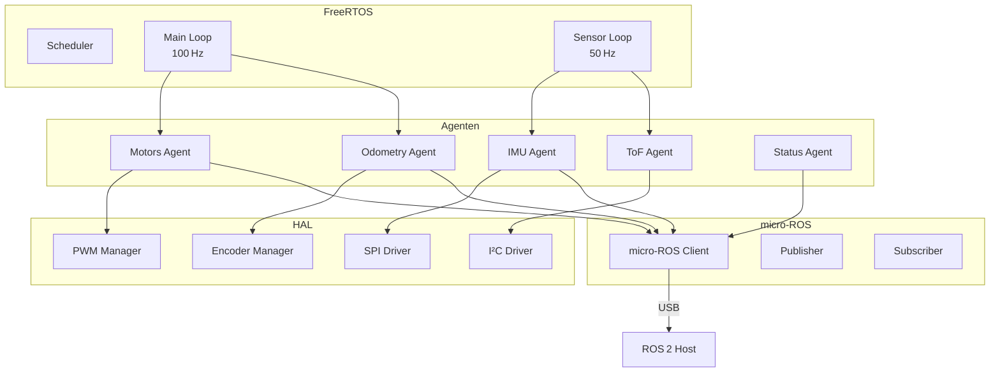

# Firmware Architecture

Die Firmware bildet die Hardware-Ebene des Roboters und kapselt alle zeitkritischen Aufgaben.

## Systemübersicht

## Configuration Parameters

!!! note "Tunable Parameters"
    These parameters can be adjusted for your specific hardware configuration and performance requirements.

| Parameter | Location | Default | Description |
|-----------|----------|---------|-------------|
| Control Loop Rate | MotorsAgent | 100 Hz | PID update frequency |
| IMU Rate | ImuAgent | 50 Hz | IMU reading frequency |
| PID Gains (Kp, Ki, Kd) | MotorPID | Tuned | Per-motor PID parameters |
| Wheel Radius | DDD | 0.047 m | For odometry calculation |
| Wheel Base | DDD | 0.220 m | For odometry calculation |
| Encoder CPR | MotorMgr | 1440 | Counts per revolution |
| PWM Frequency | PWMManager | 20 kHz | Motor PWM frequency |

### Systemübersicht-Diagramme

#### Komponenten-Architektur

#### Datenfluss & Kommunikation

#### Deployment-Architektur

