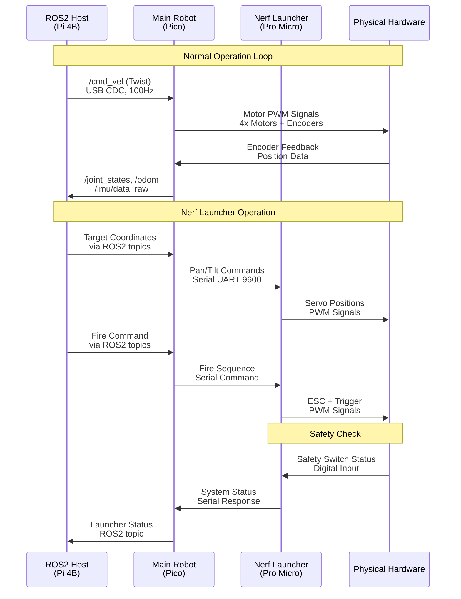

!!! info "Pin Assignment Documentation"
    This project uses multiple microcontrollers with separate pin assignments. Use this index to find the right documentation.

## Controllers Overview

| Controller | Purpose | Document | MCU |
|------------|---------|----------|-----|
| **Main Robot** | Motor control, sensors, navigation | [PINMAP_ROBOT.md](PINMAP_ROBOT.md) | Raspberry Pi Pico |
| **Nerf Launcher** | Brushless motors, servos, targeting | [PINMAP_NERF.md](PINMAP_NERF.md) | Arduino Pro Micro |

## Quick Navigation

### 🤖 **Main Robot Controller**
**[→ PINMAP_ROBOT.md](PINMAP_ROBOT.md)**

- **MCU**: Raspberry Pi Pico (RP2040)
- **Firmware**: FreeRTOS + micro-ROS
- **Functions**: 
  - 4x Mecanum motor control (PWM + Encoders)
  - IMU sensor (ICM20948 via SPI)
  - ToF sensor (VL6180X via I2C)
  - USB communication to ROS2 host

### 🎯 **Nerf Launcher Controller**
**[→ PINMAP_NERF.md](PINMAP_NERF.md)**

- **MCU**: Arduino Pro Micro (ATmega32U4)
- **Firmware**: Arduino + micro-ROS
- **Functions**:
  - 2x Brushless motor control (ESCs)
  - 3x Servo control (Pan/Tilt/Trigger)
  - Safety systems and monitoring
  - Communication with main robot

## System Architecture

```mermaid
graph TB
    subgraph "High-Level Control"
        RPI4[Raspberry Pi 4B<br/>ROS2 Humble Host<br/>• Navigation<br/>• Computer Vision<br/>• Web Dashboard]
    end
    
    subgraph "Real-Time Control"
        PICO[Raspberry Pi Pico<br/>Main Robot Controller<br/>• 4x Mecanum Motors<br/>• IMU + ToF Sensors<br/>• Wheel Encoders<br/>• FreeRTOS + micro-ROS]
    end
    
    subgraph "Launcher Control"
        PROMICRO[Arduino Pro Micro<br/>Nerf Launcher Controller<br/>• 2x Brushless Motors<br/>• 3x Servos (Pan/Tilt/Trigger)<br/>• Safety Systems<br/>• Battery Monitoring]
    end
    
    subgraph "Hardware"
        MOTORS[4x DC Motors<br/>Mecanum Wheels<br/>Hall Encoders]
        SENSORS[ICM20948 IMU<br/>VL6180X ToF<br/>Status LED]
        NERF_HW[RS2205 Motors<br/>ESCs + Servos<br/>Safety Switch]
    end
    
    RPI4 <-->|USB CDC<br/>micro-ROS| PICO
    PICO <-->|Serial/I2C<br/>Commands| PROMICRO
    PICO --> MOTORS
    PICO --> SENSORS
    PROMICRO --> NERF_HW
    
    style RPI4 fill:#4CAF50
    style PICO fill:#2196F3
    style PROMICRO fill:#FF9800
    style MOTORS fill:#E0E0E0
    style SENSORS fill:#E0E0E0
    style NERF_HW fill:#FFE0B2
```

## Communication Between Controllers



### Protocol Details

**Main Robot ↔ ROS2 Host:**
- **Protocol**: USB CDC (micro-ROS)
- **Topics**: `/cmd_vel`, `/joint_states`, `/imu/data_raw`, `/odom`
- **Rate**: 100 Hz control loop

**Main Robot ↔ Nerf Launcher:**
- **Protocol**: Serial UART (9600 baud) or I2C
- **Commands**: Target coordinates, fire commands, status
- **Safety**: Independent operation with hardware interlocks

## Design Principles

### Separation of Concerns
- **Main Robot**: Critical navigation and mobility functions
- **Nerf Launcher**: Non-critical interactive features
- **Independence**: Launcher failure doesn't affect robot mobility

### Safety First
- **Hardware Interlocks**: Physical safety switches required
- **Watchdog Timers**: Communication timeout protection
- **Emergency Stops**: Immediate shutdown capability

### Modularity
- **Separate Firmware**: Independent development and updates
- **Standard Interfaces**: USB, Serial, I2C communication
- **Hot-Swappable**: Launcher can be removed/replaced easily

## Getting Started

1. **For Robot Development**: Start with [PINMAP_ROBOT.md](PINMAP_ROBOT.md)
2. **For Launcher Development**: Start with [PINMAP_NERF.md](PINMAP_NERF.md)
3. **For System Integration**: Review both documents for communication interfaces

## Related Documentation

- [FIRMWARE_ARCHITECTURE.md](FIRMWARE_ARCHITECTURE.md) - Firmware architecture details
- [hardware_setup.md](hardware_setup.md) - Hardware assembly guide
- [README.md](README.md) - Project overview and quick start