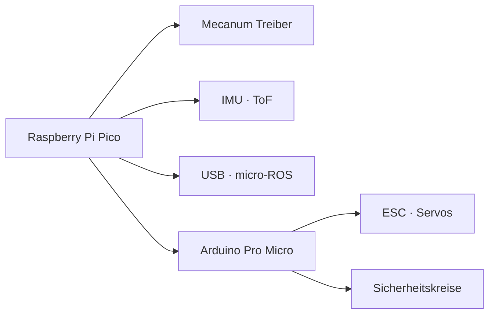

# Pinmap Übersicht

!!! info "Pin Assignment Documentation"
    This project uses multiple microcontrollers with separate pin assignments. Use this index to find the right documentation.

## Controller

| Controller | Rolle | Dokument |
|------------|-------|----------|
| Raspberry Pi Pico | Fahrplattform, Sensorik | [PINMAP_ROBOT.md](PINMAP_ROBOT.md) |
| Arduino Pro Micro | Nerf Launcher | [PINMAP_NERF.md](PINMAP_NERF.md) |

## Signal-Landkarte

## Nutzung

1. Pin-Zuordnung auswählen (Robot oder Launcher)
2. Änderungen zuerst im entsprechenden Dokument pflegen
3. Firmware-/Hardware-Repos synchron halten (siehe Hinweise in den Detailseiten)

> Detaillierte Tabellen mit Notizen, Sicherheitskennzeichen und Versionsstand befinden sich in den spezifischen Pinmap-Dokumenten.