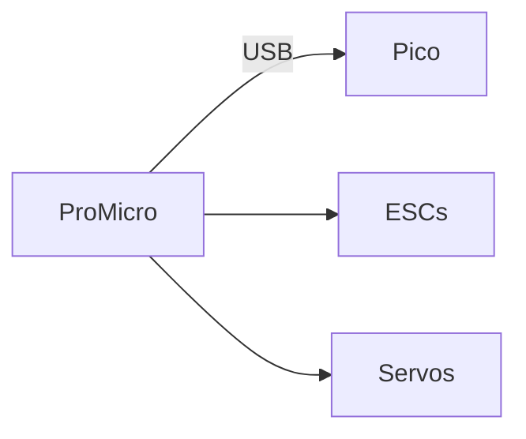

# Pro Micro Pinmap – Launcher

| Board | MCU | Firmware |
| --- | --- | --- |
| `Arduino Pro Micro` | ATmega32U4 | Arduino Framework + micro-ROS |

## Aktoren

| Pin | Signal | Funktion | Hinweise |
| --- | --- | --- | --- |
| D2 | ESC_MOTOR_1 | Brushless Motor 1 | PWM 1000‑2000 µs |
| D3 | ESC_MOTOR_2 | Brushless Motor 2 | PWM 1000‑2000 µs |
| D5 | SERVO_TILT | Tilt Servo | 9g servo (up/down) |
| D4 | SHOT_SERVO | Nerf-Dart Schieber | 360°  |

## Sicherheit & Monitoring

| Pin | Signal | Funktion | Hinweise |
| --- | --- | --- | --- |
| A0 | BATTERY_VOLTAGE | Akkuüberwachung | Spannungsteiler 1:5 |
| A1 | MOTOR_CURRENT | Stromsensor | 0–30 A |
<!-- | D8 | FIRE_BUTTON | Manueller Auslöser | Pull-up aktiv | -->
<!-- | D9 | LED_STATUS | Status LED | 2 Hz Aktivitätsanzeige | -->
<!-- | D7 | SAFETY_SWITCH | Hardware Not-Aus | muss geschlossen sein | -->

## Kommunikation

| Pin | Signal | Funktion | Hinweise |
| --- | --- | --- | --- |
| USB | USB CDC | Firmware Flash / Kommunikation | / |
<!-- | D10 | COMM_TX | UART TX → Pico | 115200 baud |
| D16 | COMM_RX | UART RX ← Pico | 115200 baud | -->

Letztes Review: 2025‑03.