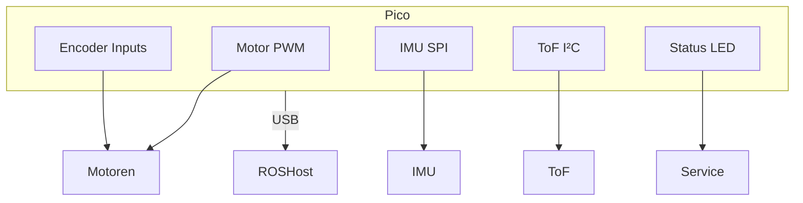

# Pico Pinmap – Fahrroboter

| Board | MCU | Firmware |
| --- | --- | --- |
| `Raspberry Pi Pico` | RP2040 | FreeRTOS + micro-ROS |

## Pin-Kategorien

### Antrieb & Encoder

| Pin | Signal | Funktion | Hinweise |
| --- | --- | --- | --- |
| GP4  | MOTOR_FR_PWM_CW  | Motor vorn rechts (CW) | PWM |
| GP5  | MOTOR_FR_PWM_CCW | Motor vorn rechts (CCW) | PWM |
| GP20 | MOTOR_FL_PWM_CW  | Motor vorn links (CW) | PWM |
| GP21 | MOTOR_FL_PWM_CCW | Motor vorn links (CCW) | PWM |
| GP14 | MOTOR_RL_PWM_CW  | Motor hinten links (CW) | PWM |
| GP15 | MOTOR_RL_PWM_CCW | Motor hinten links (CCW) | PWM |
| GP22 | MOTOR_RR_PWM_CW  | Motor hinten rechts (CW) | PWM |
| GP28 | MOTOR_RR_PWM_CCW | Motor hinten rechts (CCW) | PWM |
| GP6/7 | MOTOR_FL_ENCODER_A/B | Encoder vorn links | Interrupt |
| GP8/9 | MOTOR_FR_ENCODER_A/B | Encoder vorn rechts | Interrupt |
| GP10/11 | MOTOR_RL_ENCODER_A/B | Encoder hinten links | Interrupt |
| GP12/13 | MOTOR_RR_ENCODER_A/B | Encoder hinten rechts | Interrupt |

### Sensorik

| Pin | Signal | Funktion | Hinweise |
| --- | --- | --- | --- |
| GP2  | VL6180X_SDA | ToF I²C SDA | **fest** (I²C1) |
| GP3  | VL6180X_SCL | ToF I²C SCL | **fest** |
| GP16 | IMU_MISO | SPI0 MISO | **fest** |
| GP17 | IMU_CS   | SPI0 CS | **fest** |
| GP18 | IMU_SCK  | SPI0 SCK | **fest** |
| GP19 | IMU_MOSI | SPI0 MOSI | **fest** |
| GP26 | LED_STATUS | Status LED | 1 Hz Heartbeat |

### Kommunikation

| Pin | Signal | Funktion | Hinweise |
| --- | --- | --- | --- |
| USB | USB CDC | micro-ROS Agent ↔ ROS 2 | Haupt |
| GP0 | UART0_TX | Debug UART TX | Debugging |
| GP1 | UART0_RX | Debug UART RX | Debugging |

Letztes Review: 2025‑03.