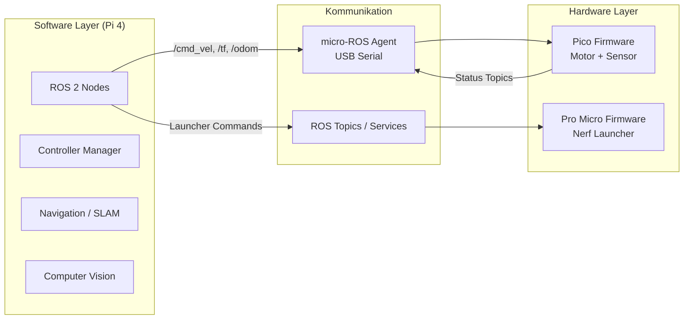
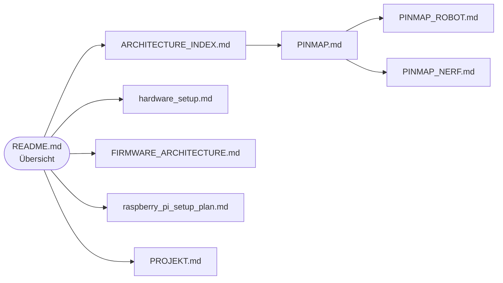
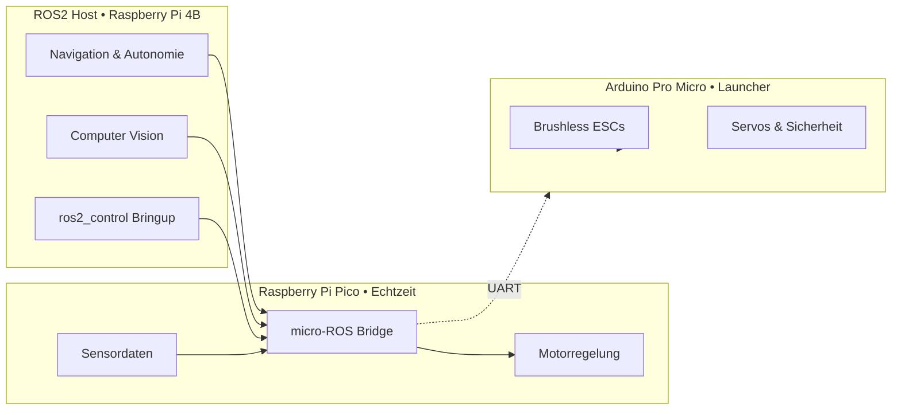

# Robot Projekt Übersicht

Der Workspace gliedert sich in zwei strikt getrennte Ebenen:

- **Software-Ebene** auf dem Raspberry Pi 4 mit ROS 2 Humble für Navigation, Teleoperation, Computer Vision und Betreiber-Dashboards.
- **Hardware-Ebene** auf den Mikrocontrollern (Raspberry Pi Pico, Arduino Pro Micro) für deterministische Motor- und Launcher-Steuerung.

## System-Layer auf einen Blick



**Prinzip:** Software-Features werden ausschließlich über ROS 2 umgesetzt; alle hardwarenahen Zeitkritischen Abläufe laufen autark in der Firmware.

## Dokumentations-Navigator

| Fokus | Zweck | Nächster Schritt |
|-------|-------|------------------|
| **Systemüberblick** | Ziele, Architektur, Designentscheidungen | [PROJEKT.md](PROJEKT.md) |
| **Hardware bauen** | Verkabelung, Montage, Prüfungen | [hardware_setup.md](hardware_setup.md) |
| **Firmware verstehen** | Pico-Agenten, Datenflüsse, Echtzeit | [FIRMWARE_ARCHITECTURE.md](FIRMWARE_ARCHITECTURE.md) |
| **Pinbelegung** | Zuordnung der Controller-Pins | [PINMAP.md](PINMAP.md) |
| **Raspberry Pi betreiben** | Betriebssystem, Docker, Services | [raspberry_pi_setup_plan.md](raspberry_pi_setup_plan.md) |

## Dokumentation finden




## Architektur-Skizze



## Wesentliche Kennzahlen

| Kategorie | Hardware Layer | Software Layer |
| --- | --- | --- |
| Recheneinheit | Raspberry Pi 4B (4 GB), Raspberry Pi Pico | Arduino Pro Micro |
| Laufzeit | ROS 2 Humble (rclcpp, Nav2, SLAM Toolbox) | FreeRTOS + bare metal Treiber |
| Schnittstellen | USB CDC, UART, SPI, I²C, PWM | ROS 2 Topics, Services, Actions |

<!-- 
### Topic Architecture

```
┌─────────────────────┐
│ Navigation / Teleop │
└──────────┬──────────┘
           │ /cmd_vel (Twist)
           ▼
┌─────────────────────┐
│ Mecanum Controller  │
└──────────┬──────────┘
           │ velocity commands
           ▼
┌─────────────────────┐
│ Hardware Interface  │──────> /cmd_vel (Twist)
│  (ros2_control)     │<────── /joint_states
└─────────────────────┘        /imu/data_raw
           │
           ▼
┌─────────────────────┐
│  micro-ROS Agent    │
│  (topic remapping)  │
└──────────┬──────────┘
           │ USB Serial
           ▼
┌─────────────────────┐
│  Pico Firmware      │
│  (micro-ROS)        │
└─────────────────────┘
``` -->
